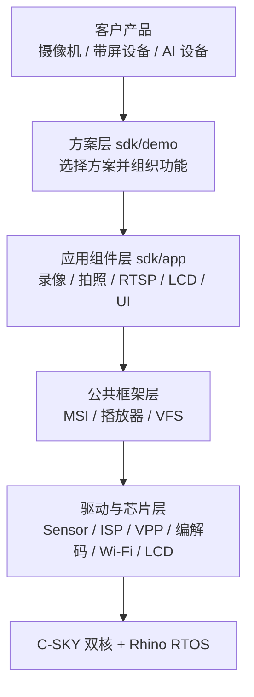
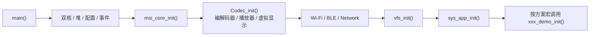
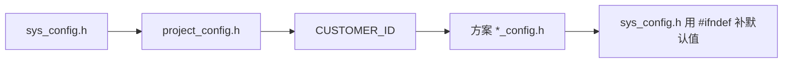

# TXW82x SDK 架构与配置说明

> 适用版本：v2.7.1.7
> 本文用于帮助客户选择参考方案、理解 SDK 分层，并完成最基本的配置修改。

## 1. SDK 整体架构



客户开发通常只需要修改两层：

- 在 `sdk/demo/<方案>/` 中组织产品功能。
- 通过公共接口调用 `sdk/app` 和框架能力。

不建议直接修改 `sdk/driver`、`sdk/lib`、`sdk/hal`、`sdk/chip` 和 `csky` 内部实现。

## 2. 启动流程



方案入口位于 `project/txw82xApp/main.c` 的 `sys_app_init()`。客户不需要在业务代码中重复初始化 MSI 或系统 VFS。

## 3. 快速开始

1. 在下表中选择最接近产品需求的 `CUSTOMER_ID`。
2. 修改 `project/txw82xApp/project_config.h`。
3. 在对应方案 `*_config.h` 中选择 Sensor、屏幕、网络和内存配置。
4. 使用 CDK IDE 打开 `project/txw82xApp/txw82xApp.cdkproj` 编译。
5. 新增 `.c` 文件时，手动加入 `txw82xApp.cdkproj`。

示例：选择 IPC 1080P 方案。

```c
#define CUSTOMER_ID 8
```

## 4. 方案 ID

| ID | 方案 | 适用产品 | 默认主要功能 | 关键说明 |
| --- | --- | --- | --- | --- |
| 1 | AI 语音对话 | 无屏语音助手 | Wi-Fi、语音唤醒、Coze 对话 | 需要配置云端账号和音频硬件 |
| 2 | AI 视觉对话 | 带屏 AI 助手 | AI 语音、MIPI LCD、LVGL | 默认没有初始化摄像头链路 |
| 3 | AI 闹钟 | 桌面 AI 设备 | SPI LCD、触摸、AI、SNTP、Flash 文件系统 | UI 资源需要写入内部 Flash |
| 4 | ISP 调试 | Sensor 画质调试 | USB 调试、H.264、JPEG、RTSP | 用于调试，不建议直接量产 |
| 5 | IPC 720P | 基础网络摄像机 | H.264、JPEG、RTSP、拍照、录像 | 推荐作为 720P 产品起点 |
| 6 | LCD 720P | 带屏摄像机 | IPC 功能、MIPI LCD、LVGL | 当前主要使用 LCD P0 视频层 |
| 7 | IPC Sleep 720P | 低功耗IPC | RTSP、低功耗挂起和恢复 | 默认未启动录像服务 |
| 8 | IPC 1080P | 高清网络摄像机 | 1080P H.264、JPEG、RTSP、拍照、录像 | GC1084/GC2053 自动识别候选 |
| 9 | 电池相机 1080P | 电池相机 | RTSP、低功耗、电源域控制 | 默认只启用主 H.264 编码链 |

方案选择代码位于：

```text
project/txw82xApp/project_config.h
```

对应方案源码位于：

```text
sdk/demo/<方案目录>/
```

## 5. 配置生效方式

`sys_config.h` 首先包含 `project_config.h`，再补齐未定义的默认宏：



配置规则：

- 修改当前方案的 `*_config.h`。
- 不要直接修改 `sys_config.h` 默认值。
- 一个固件只选择一个 `CUSTOMER_ID`。
- 宏已开启不代表功能已经接通，还要确认方案初始化代码调用了对应模块。

## 6. 常用配置宏

### 6.1 系统与内存

| 宏 | 作用 | 修改建议 |
| --- | --- | --- |
| `DEFAULT_SYS_CLK` | 系统主频 | 保持方案默认值，性能不足时再评估，可以通过降低优化整机功耗（不建议低于160M），可以超频至240M，需要配合修改硬件VDD供电（参考硬件设计指南） |
| `CONFIG_PSRAM_AVHEAP_SIZE` | 音视频 PSRAM 大小 | 1080P、录像和多路流需要更大空间 |
| `CONFIG_AVHEAP_SIZE` | 音视频 SRAM 大小 | 分辨率越高需求越大 |
| `MORE_SRAM` | 将部分数据转移到 PSRAM | SRAM 不足时使用，可能影响性能 |

### 6.2 Sensor 和码流

| 宏 | 作用 | 常见值 |
| --- | --- | --- |
| `DEV_SENSOR_GC1084` | 选择 GC1084 | 720P 方案常用 |
| `DEV_SENSOR_GC2053` | 选择 GC2053 | 1080P 方案常用 |
| `SUB_STREAM_EN` | 启用副码流配置 | `0` / `1` |
| `SUB_STREAM_WIDTH` | 副码流宽度(与主码流宽度计算缩小比例) | 640 / 1280 |
| `JPG_NODE_COUNT` | JPEG 分片节点数量 | 常见 30 |
| `MP4_MAX_SINGLE_SIZE` | MP4 单文件大小上限 | 常见 100 MB |

多个 `DEV_SENSOR_*` 同时置 1，通常表示开机自动识别候选，不表示多摄并行。

副码流需要同时满足：

1. `SUB_STREAM_EN=1`。
2. VPP 已配置副缓冲。
3. `app_h264_init()` 启用了副码流。
4. 下游选择了正确的帧子类型。

### 6.3 网络

| 宏 | 作用 | 常见值 |
| --- | --- | --- |
| `WIFI_MODE_DEFAULT` | 默认 Wi-Fi 模式 | `WIFI_MODE_AP` / `WIFI_MODE_STA` |
| `SYS_APP_DHCPD` | AP 模式 DHCP 服务 | `0` / `1` |
| `SYS_APP_SNTP` | 网络校时 | `0` / `1` |
| `SYS_APP_BLENC` | BLE 配网 | `0` / `1` / `2` |
| `WIFI_TX_AGG_EN` | Wi-Fi 发送聚合 | 按时延需求调整 |
| `WIFI_RX_AGG_EN` | Wi-Fi 接收聚合 | 需要足够 RX Buffer |

### 6.4 存储和 OTA

| 宏 | 作用 | 使用条件 |
| --- | --- | --- |
| `FS_EN` | 文件系统总开关 | 拍照、录像、OTA 需要开启 |
| `SDH_EN` | SD Host | 使用 SD 卡时开启 |
| `FLASHDISK_EN` | 内部 Flash 文件系统 | AI 闹钟等方案使用 |
| `STARTUP_OTA` | 开机检查 OTA 文件 | 方案还需调用 `app_sd_init()` |
| `USE_FAT_CACHE` | FatFS 缓存优化 | 录像产品建议开启 |

### 6.5 LCD 和输入

| 宏 | 作用 |
| --- | --- |
| `LCD_ST7701S_MIPI_EN` | ST7701S MIPI LCD |
| `LCD_ST7789_SPI_EN` | ST7789 SPI LCD |
| `SUPPORT_LCD` | 编译 LCD 显示框架 |
| `DMA2D_EN` | 2D 图形加速 |
| `LVGL_INPUTDEV_SUPPORT` | 按键或触摸输入类型 |

### 6.6 播放器和解码

| 宏 | 作用 |
| --- | --- |
| `SUPPORT_TXMPLAYER` | 启用播放器框架 |
| `SUPPORT_DECODER_H264` | 启用 H.264 解码 |
| `SUPPORT_DECODER_JPEG` | 启用 JPEG 解码 |
| `AAC_DEC_CTRL` | AAC 解码运行核 |
| `MP3_DEC_CTRL` | MP3 解码运行核 |
| `OPUS_DEC_CTRL` | OPUS 解码运行核 |

## 7. 引脚配置

启用 `PIN_FROM_PARAM` 后，板卡引脚由以下文件配合生成：

```text
project/txw82xApp/config.cfg
project/txw82xApp/pin_param.h
project/txw82xApp/cfg/
```

注意：

- 新增 `pin_param.h` 宏时追加到文件末尾。
- 电源电压和 GPIO 有效电平必须与原理图一致。
- 修改 cfg 后重新执行固件打包流程。

## 8. 双核交互

TXW82x 使用 CPU0（应用核）和 CPU1（Core CPU）协同工作。默认情况下，CPU1 由 SDK 负责 Wi-Fi/LMAC 协议栈及其底层资源，CPU0 负责方案初始化、音视频框架和客户应用。双核之间已经由 SDK 初始化 CPU RPC（下文简称 `cpurpc`）及底层邮箱，客户不需要再次调用 `cpu_rpc_init()`，也不要自行建立第二套核间通信机制。

### 8.1 双核职责和使用原则

客户业务默认运行在 CPU0。确需利用 CPU1 分担计算时，CPU1 上新增的客户代码应限定为**纯软件运算**：输入为明确的数值或只读数据，输出为数值或结果结构体，不访问硬件，不改变系统调度状态。若需新增软件运算任务，只允许由 CPU0 通过本章介绍的 `cpu1_new_task()` 受控创建，**任务优先级不建议高于 Wi-Fi/LMAC 协议栈处理任务**，否则会影响实际流量。双核调用只使用 SDK 的 `cpurpc` 接口，并评审是否合理。

以下资源属于 SDK/平台保留范围，客户代码不建议在 CPU1 上直接使用，也不建议通过跨核调用绕过封装：

| 类别 | 限制 |
| --- | --- |
| 硬件驱动 | 普通客户代码不得直接在 CPU1 调用 GPIO、UART、I2C、SPI、DMA、Timer、ADC、Sensor、ISP、VPP、编解码、LCD、存储、Wi-Fi 等驱动接口，也不得操作寄存器或硬件地址。只有经平台评审并明确允许双核访问的共享硬件/驱动资源，才能按 8.5 节要求使用 CPU spinlock 保护。 |
| OSAL 同步与通信 | 不在跨核代码中创建、删除或等待 OSAL 的消息队列、事件、信号量、互斥锁、条件变量、工作队列和定时器；不得用这些对象作为核间协议。 |
| 中断与调度 | 除通过 `cpu1_new_task()` 创建受控纯计算任务外，不自行创建、删除或控制 CPU1 任务；不开关全局或外设中断，不注册/注销 ISR，不修改中断优先级，不调用会阻塞、休眠或改变 CPU 亲和性的接口。 |
| 内存与缓存 | 不传递 CPU1 私有堆、驱动缓冲区或栈地址；不得让另一核长期持有可变指针。共享数据必须是固定布局的 POD 数据，并由调用方保证生命周期和缓存一致性。 |
| 系统控制 | 不执行复位、睡眠/唤醒、时钟、电源域、Flash/文件系统和网络状态控制。 |
| 硬浮点 | 硬浮点在TXW82x系列目前只有CPU0支持，CPU1不支持，因此客户代码不建议在CPU1侧进行浮点运算 |

### 8.2 cpurpc 接口和调用方式

`cpurpc` 的公共声明位于 `sdk/include/lib/rpc/cpurpc.h`：

```c
int32 cpu_rpc_call(uint32 func_id, uint32 *args,
                   uint32 arg_cnt, uint32 sync);

#define CPU_RPC_CALL(f) \
    cpu_rpc_call(RPC_FUNCID_##f, args, ARRAY_SIZE(args), 1)
#define CPU_RPC_CALL_ASYNC(f) \
    cpu_rpc_call(RPC_FUNCID_##f, args, ARRAY_SIZE(args), 0)
#define RPC_FUNC_DEF(f) [RPC_FUNCID_##f] = f
```

| 接口 | 用途 |
| --- | --- |
| `CPU_RPC_CALL(f)` | 同步调用。调用方等待远端函数执行完成，返回值为远端函数返回值。客户的纯运算交互优先使用此方式。 |
| `CPU_RPC_CALL_ASYNC(f)` | 异步调用。调用方不等待远端计算结果，不适合需要直接取得计算结果的场景。客户不得在未评审参数生命周期的情况下使用。 |
| `RPC_FUNC_DEF(f)` | 将 RPC ID 和远端实际函数关联，供 RPC 分发器查找。 |

一次完整调用包含以下三部分：

1. 在 `sdk/include/chip/txw82x/rpc.h` 的目标核枚举中分配 `RPC_FUNCID_<函数名>`。CPU0 调 CPU1 时使用 `CPU1_RPC_FUNCID`，CPU1 调 CPU0 时使用 `CPU0_RPC_FUNCID`。
2. 调用核将参数依次放入名为 `args` 的 `uint32` 数组，再调用 `CPU_RPC_CALL(<函数名>)`。
3. 目标核在 `rpc_funcs` 表中使用 `RPC_FUNC_DEF(<函数名>)` 注册实际函数。

RPC ID 和两端函数表必须保持匹配。客户不要自行调整已有 ID 的顺序；需要新增专用 RPC ID 时，统一修改两核工程并评审接口。

### 8.3 使用`cpu1_run_func()`在 CPU1 执行软件算法

`cpu1_run_func()` 是 SDK 中现有的 CPU0 调用 CPU1 的简单同步示例。它允许 CPU0 传入一个 CPU1 可执行的函数地址和三个 `uint32` 参数，并取得该函数的返回值。

第一步，`sdk/include/chip/txw82x/rpc.h` 在 CPU1 的 RPC ID 表中定义函数 ID：

```c
enum CPU1_RPC_FUNCID {
    RPC_FUNC_ID(sys_enter_sleep),
    RPC_FUNC_ID(cpu1_run_func),
    /* ... */
};
```

第二步，`sdk/chip/txw82x/rpc0.c` 在 CPU0 侧提供调用封装：

```c
int32 cpu1_run_func(void *func, uint32 p1, uint32 p2, uint32 p3)
{
    uint32 args[] = {(uint32)func, p1, p2, p3};
    return CPU_RPC_CALL(cpu1_run_func);
}
```

`CPU_RPC_CALL(cpu1_run_func)` 会自动使用 `RPC_FUNCID_cpu1_run_func`、`args` 数组长度和同步标志发起调用。CPU0 会等待 CPU1 执行完成，因此返回值就是 CPU1 计算函数的返回值。

第三步，`sdk/chip/txw82x/rpc1.c` 在 CPU1 侧实现分发函数并注册到函数表：

```c
static int32 cpu1_run_func(void *func, uint32 p1,
                           uint32 p2, uint32 p3)
{
    if (func) {
        return ((uint32 (*)(uint32, uint32, uint32))func)(p1, p2, p3);
    }
    return -EINVAL;
}

static const void *rpc_funcs[CPU1_RPC_FUNCID_NUM] = {
    RPC_FUNC_DEF(sys_enter_sleep),
    RPC_FUNC_DEF(cpu1_run_func),
    /* ... */
};
```

实际调用链如下：

```text
CPU0 业务代码
    → cpu1_run_func(func, p1, p2, p3)
    → CPU_RPC_CALL(cpu1_run_func)
    → CPU1 rpc_funcs[RPC_FUNCID_cpu1_run_func]
    → CPU1 执行 func(p1, p2, p3)
    → 计算结果同步返回 CPU0
```

例如，将一个只做整数运算的函数安排到 CPU1 执行：

```c
/* 该函数必须位于 CPU1 可取指执行的共享地址范围。 */
static uint32 customer_calc(uint32 sample_count,
                            uint32 weight, uint32 offset)
{
    return sample_count * weight + offset;
}

extern int32 cpu1_run_func(void *func, uint32 p1,
                           uint32 p2, uint32 p3);

/* CPU0 发起同步调用，result 接收 CPU1 的计算结果。 */
int32 result = cpu1_run_func((void *)customer_calc, 100, 3, 20);
/* result == 320 */
```

使用此接口时必须注意：不要在 `cpu1_run_func()` 的计算函数中调用 `os_msgqueue_*`、`os_event_*`、`os_sem_*`、`os_mutex_*`、`os_task_*`、`os_irq_*` 或任何 `*_request_irq`/`*_enable_irq`/`*_disable_irq` 接口。

### 8.4 使用 `cpu1_new_task()` 创建 CPU1 计算任务

`cpu1_new_task()` 用于从 CPU0 创建一个运行在 CPU1 上的客户计算任务。CPU0 侧封装位于 `sdk/chip/txw82x/rpc0.c`，调用 `CPU_RPC_CALL(cpu1_new_task)` 发起同步 RPC；CPU1 侧实现位于 `sdk/chip/txw82x/rpc1.c`，最终调用 `os_task_create()` 创建任务。对应 RPC ID 已在 `sdk/include/chip/txw82x/rpc.h` 注册，客户不需要新增 ID。

```text
CPU0 业务代码
    → cpu1_new_task(...)
    → CPU_RPC_CALL(cpu1_new_task)
    → CPU1 rpc_funcs[RPC_FUNCID_cpu1_new_task]
    → CPU1 os_task_create(...)
    → CPU1 任务句柄同步返回 CPU0
```

当前接口尚未在公共头文件中声明，使用时包含 OSAL 任务类型定义，并在客户模块中声明如下原型：

```c
#include "osal/task.h"

extern void *cpu1_new_task(const char *name, os_task_func_t func,
                           void *arg, uint32 prio, uint32 time,
                           void *stack, uint32 stack_size);
```

各参数含义如下：

| 参数 | 说明 |
| --- | --- |
| `name` | CPU1 任务名。字符串地址必须对两核可见，并在 CPU1 完成创建及使用任务名期间保持有效。建议使用静态常量字符串。 |
| `func` | CPU1 任务入口，类型为 `void (*)(void *arg)`。函数必须位于 CPU1 可取指执行的共享地址范围。 |
| `arg` | 传给任务入口的参数。地址必须对两核可见，且生命周期覆盖 CPU1 任务的实际使用期；不能传 CPU0 栈上的临时变量地址。 |
| `prio` | CPU1 任务优先级。客户任务不得抢占 Wi-Fi/LMAC 关键处理，建议从 `OS_TASK_PRIORITY_NORMAL` 开始，并结合实际流量评估。 |
| `time` | 任务时间片，简单计算任务可使用 `0`。 |
| `stack` | 自定义任务栈地址。传 `NULL` 时由 CPU1 的 `os_task_create()` 动态分配；如自行提供，必须是 CPU1 可访问且在整个任务生命周期内有效的内存。 |
| `stack_size` | 任务栈大小，单位为字节。必须按算法的调用深度和局部变量用量评估。 |

下面示例从 CPU0 创建一个只执行整数计算的 CPU1 任务。示例使用静态对象，避免把 CPU0 临时栈地址传给 CPU1：

```c
#include "osal/task.h"

struct cpu1_calc_context {
    uint32 input;
    uint32 output;
    uint32 done;
};

/* 需由链接和内存布局保证 CPU0、CPU1 均可访问。 */
static struct cpu1_calc_context g_cpu1_calc_ctx;
static const char g_cpu1_calc_task_name[] = "cust_calc";

static void customer_calc_task(void *arg)
{
    struct cpu1_calc_context *ctx =
        (struct cpu1_calc_context *)arg;

    /* CPU1 任务只做有边界的纯软件计算。 */
    ctx->output = ctx->input * 3U + 20U;
    ctx->done = 1U;
}

extern void *cpu1_new_task(const char *name, os_task_func_t func,
                           void *arg, uint32 prio, uint32 time,
                           void *stack, uint32 stack_size);

static int32 start_customer_calc_on_cpu1(uint32 input)
{
    void *task;

    g_cpu1_calc_ctx.input = input;
    g_cpu1_calc_ctx.done = 0U;

    task = cpu1_new_task(g_cpu1_calc_task_name,
                         customer_calc_task,
                         &g_cpu1_calc_ctx,
                         OS_TASK_PRIORITY_NORMAL,
                         0U, NULL, 1024U);
    if (task == NULL) {
        return RET_ERR;
    }

    return RET_OK;
}
```

此例只演示任务创建和参数传递，不表示 CPU0 可以直接轮询 `done`。`volatile` 也不能替代双核缓存一致性处理；共享结果的发布和读取必须结合实际内存属性、缓存 clean/invalidate 规则或经评审的专用 RPC 设计。若使用 CPU spinlock 保护共享状态，还必须遵守 8.5 节，且仍需单独处理缓存一致性。

### 8.5 CPU spinlock（`splock`）的使用

CPU spinlock 用于两个 CPU 可能同时进入的短小临界区，主要场景是串行化双方对同一个共享硬件/驱动资源的操作，也可用于保护共享内存、状态变量或软件数据结构。它只提供跨核互斥，不赋予 CPU1 客户代码访问某个驱动的权限，也不负责缓存一致性和对象生命周期。

公共接口位于 `sdk/include/lib/rpc/cpurpc.h`：

```c
int32 cpu_splock_resume(uint32 addr, uint32 irq_num);
int32 cpu_splock_init(uint32 addr, uint32 irq_num);
int32 cpu_splock_lock(CPU_SPLOCK_ID lock_id);
int32 cpu_splock_unlock(CPU_SPLOCK_ID lock_id);
```

CPU0 和 CPU1 已分别在 `project/txw82xApp/device.c`、`project/txw82xCore/device.c` 中调用 `cpu_splock_init()` 完成初始化。客户代码**不要再次调用** `cpu_splock_init()` 或 `cpu_splock_resume()`，只使用 `cpu_splock_lock()` 和 `cpu_splock_unlock()`。

锁号定义在 `sdk/include/chip/txw82x/txw82x.h`。当前版本的客户项目从 `CPU_SPLOCK_ID_0` 开始顺序分配，但每分配一个 ID 前仍需确认未被 SDK 和方案代码占用，并在项目中集中登记“锁号—资源”对应关系。同一资源在 CPU0、CPU1 上必须使用同一个 ID，一个 ID 只保护一个定义清楚的资源或临界区。

`CPU_SPLOCK_ID_11_PMU`、`CPU_SPLOCK_ID_12_SYSCTRL`、`CPU_SPLOCK_ID_13_DMA2D`、`CPU_SPLOCK_ID_14_EFUSE` 和 `CPU_SPLOCK_ID_15_DCACHE` 是当前版本的平台命名保留锁号，客户不得使用。**升级 SDK 后，必须重新检查 `CPU_SPLOCK_ID` 的完整枚举和 SDK/方案实际占用情况，重新确认客户锁号；不能直接沿用旧版本的 ID 分配结论。**

通用加锁模板如下。只有 `cpu_splock_lock()` 返回 `RET_OK` 后才能访问资源；未取得锁时不得进入临界区，也不得调用对应的 `unlock()`。解锁返回值同样需要检查：

```c
int32 ret;
int32 unlock_ret;

ret = cpu_splock_lock(CPU_SPLOCK_ID_0);
if (ret != RET_OK) {
    /* 本次未取得锁，不访问受保护资源。 */
    return ret;
}

/* 只执行短小、无阻塞的临界区操作。 */

unlock_ret = cpu_splock_unlock(CPU_SPLOCK_ID_0);
if (unlock_ret != RET_OK) {
    /* 记录并处理解锁异常。 */
    return unlock_ret;
}
```

共享硬件/驱动是 spinlock 的主要使用场景，但必须先确认平台允许该资源由两个 CPU 访问。以下代码是使用方式的伪代码，`customer_device_update_locked()` 不是 SDK 的真实接口：

```c
/* 仅限平台评审并明确允许双核访问的设备。 */
int32 ret = cpu_splock_lock(CPU_SPLOCK_ID_0);
if (ret == RET_OK) {
    customer_device_update_locked(); /* 短小的硬件操作，占位函数。 */

    if (cpu_splock_unlock(CPU_SPLOCK_ID_0) != RET_OK) {
        /* 记录并处理解锁异常。 */
    }
} else {
    /* 未取得锁，不访问该设备。 */
}
```

对于共享内存临界区，CPU0 和 CPU1 也使用同一个锁号。例如，下列函数可由两核调用，以保护一次成组更新：

```c
struct customer_shared_stats {
    uint32 count;
    uint32 last_result;
};

/* 示例假定该对象位于两核均可访问的共享内存。 */
static struct customer_shared_stats g_customer_stats;

static int32 customer_stats_update(uint32 result)
{
    int32 ret;
    int32 unlock_ret;

    ret = cpu_splock_lock(CPU_SPLOCK_ID_0);
    if (ret != RET_OK) {
        return ret;
    }

    g_customer_stats.count++;
    g_customer_stats.last_result = result;

    unlock_ret = cpu_splock_unlock(CPU_SPLOCK_ID_0);
    return unlock_ret;
}
```

该例中的锁只防止两个 CPU 同时修改字段。共享内存仍须位于两核均可访问的地址范围，并根据平台内存属性处理写回、失效等缓存一致性要求；给变量增加 `volatile` 或仅执行 lock/unlock 都不能替代缓存维护。

## 9. 客户开发建议

1. 先让参考方案原始功能稳定运行，再增加客户功能。
2. 音视频数据使用 MSI，不直接访问编解码器内部缓冲。
3. 客户代码放在独立方案目录中。
4. 文件访问优先使用标准接口和 `/sd0/...` 路径。
5. 新增源文件必须加入 CDK 工程。
6. 双核客户代码仅用于纯软件运算；CPU1 任务通过 `cpu1_new_task()` 受控创建，共享临界区使用已登记的 CPU spinlock 保护；驱动、其他 OSAL 消息/事件和中断仍由 SDK/平台边界管理。
7. 量产前验证 SD 插拔、断网、空间不足、异常断电和睡眠唤醒。

框架原理见[TXW82x SDK 框架原理说明](https://taixin-semi.com/zh/docs/txw82x/latest/TXW82x%20SDK%20%E6%A1%86%E6%9E%B6%E5%8E%9F%E7%90%86%E8%AF%B4%E6%98%8E)，录像、拍照和图传的调用方法见[TXW82x SDK 视频应用功能使用说明](https://taixin-semi.com/zh/docs/txw82x/latest/TXW82x%20SDK%20%E8%A7%86%E9%A2%91%E5%BA%94%E7%94%A8%E5%8A%9F%E8%83%BD%E4%BD%BF%E7%94%A8%E8%AF%B4%E6%98%8E)。
