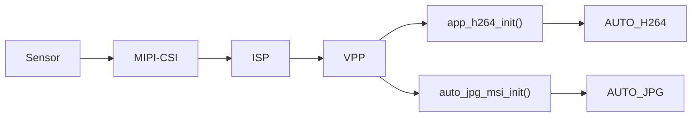
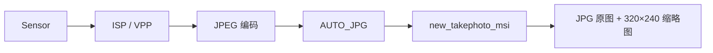
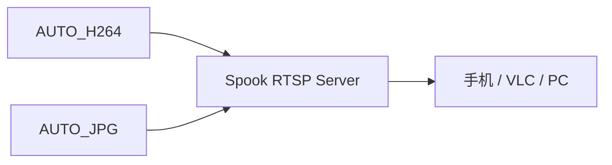

# TXW82x SDK 视频应用功能使用说明

> 适用版本：v2.7.1.7
> 本文说明如何使用录像、拍照和 RTSP 图传。只列出客户需要调用的接口和必要的数据流。

## 1. 功能速查

| 功能 | 数据源 | 主要接口 | 默认结果 |
| --- | --- | --- | --- |
| 拍照 | `AUTO_JPG` | `new_takephoto_msi()` + `MSI_CMD_START` | JPG 原图和缩略图 |
| MP4 录像 | `AUTO_H264` | `mp4_record_msi_init()` + `MSI_MEDIA_CTRL_RECORD_START` | MP4 文件 |
| AVI 录像 | `AUTO_H264` | `avi_record_msi_init()` | AVI 文件 |
| RTSP MJPEG | `AUTO_JPG` | `spook_init()` | `/webcam` |
| RTSP H.264 | `AUTO_H264` | `spook_init()` | `/h264` |
| 完整 HTTP 应用 | H.264 + JPEG | `config_Viidure(80)` | HTTP 拍照、录像和配置服务 |

## 2. 使用前提

摄像头方案需要先完成以下初始化：



IPC、LCD 和 ISP 调试参考方案已经完成这些初始化。客户在参考方案中使用功能时，不需要重复初始化 Sensor、ISP、VPP 和编码器。

拍照和录像还需要：

- `FS_EN=1`。
- SD 卡已插入并挂载。
- 已初始化 SD 工作队列。
- AV SRAM 和 PSRAM 配置足够。

---

## 3. 拍照

### 3.1 数据流



### 3.2 创建拍照组件

```c
#include "app/takephoto_module/takephoto.h"
#include "stream_define.h"

struct msi *photo_msi;

photo_msi = new_takephoto_msi(
    FRAMEBUFF_SOURCE_CAMERA0,
    FSTYPE_NONE);

if (photo_msi) {
    msi_add_output(NULL, AUTO_JPG, photo_msi, NULL);
}
```

参数说明：

| 参数 | 说明 |
| --- | --- |
| `FRAMEBUFF_SOURCE_CAMERA0` | 接收主摄像头图片 |
| `FSTYPE_NONE` | 不限制 JPEG 子类型 |

### 3.3 触发拍照

拍 1 张：

```c
msi_do_cmd(photo_msi, MSI_CMD_START, 1, 0);
```

连拍 2 张：

```c
msi_do_cmd(photo_msi, MSI_CMD_START, 2, 0);
```

第三个参数表示拍照张数。拍照完成后组件会自动停止接收。

### 3.4 释放拍照组件

```c
msi_del_output(NULL, AUTO_JPG, photo_msi, NULL);
msi_destroy(photo_msi);
photo_msi = NULL;
```

### 3.5 默认文件

| 内容 | 当前内部路径 |
| --- | --- |
| 原图 | `0:/IMG/...JPG` |
| 缩略图 | `0:/thumb/...JPG` |

客户自己读取文件时建议使用 VFS 路径 `/sd0/IMG/...`。

---

## 4. 录像

### 4.1 数据流


如果启用音频：


### 4.2 创建 MP4 录像组件

```c
#include "app/video_record/video_record.h"
#include "stream_define.h"

struct msi *h264_msi;
struct msi *record_msi;

struct video_record_cfg cfg = {
    .name = "customer_rec",
    .srcID = FRAMEBUFF_SOURCE_CAMERA0,
    .filter = FSTYPE_H264_VPP_DATA0,
    .rec_time = 1,
    .audio_en = 0,
    .mode = MP4_MODE_NORMAL,
    .video_fps = 25,
    .file_process = NULL,
};

h264_msi = msi_find(AUTO_H264, 1);
record_msi = mp4_record_msi_init(&cfg);

if (h264_msi && record_msi) {
    msi_add_output(h264_msi, NULL, record_msi, NULL);
}
```

配置说明：

| 字段 | 说明 |
| --- | --- |
| `name` | 录像组件名称，必须唯一 |
| `srcID` | 摄像头来源 |
| `filter` | 选择主码流或副码流 |
| `rec_time` | 单文件时长，单位分钟 |
| `audio_en` | `1` 录制音频，`0` 不录音频 |
| `mode` | 普通、缩时或事件录像 |
| `video_fps` | 必须与实际 H.264 帧率一致 |
| `file_process` | `NULL` 使用默认 MP4 文件处理 |

1080P 方案的实际帧率可能为 15，不要固定使用示例中的 25。

### 4.3 开始录像

```c
msi_do_cmd(record_msi,
           MSI_CMD_MEDIA_CTRL,
           MSI_MEDIA_CTRL_RECORD_START,
           0);
```

### 4.4 获取录像时长

```c
uint32_t record_time = 0;

msi_do_cmd(record_msi,
           MSI_CMD_MEDIA_CTRL,
           MSI_MEDIA_CTRL_GET_RECTIME,
           (uint32_t)&record_time);
```

### 4.5 停止并释放

```c
record_msi->enable = 0;
msi_do_cmd(record_msi, MSI_CMD_PRE_DESTROY, 0, 0);
msi_del_output(h264_msi, NULL, record_msi, NULL);
msi_destroy(record_msi);
msi_put(h264_msi);

record_msi = NULL;
h264_msi = NULL;
```

`MSI_CMD_PRE_DESTROY` 会通知录像组件完成文件封装收尾。不要直接拔卡或立即断电。

### 4.6 AVI 录像

创建接口改为：

```c
record_msi = avi_record_msi_init(&cfg);
```

其余 MSI 连接和生命周期管理方式相同。

### 4.7 默认文件

默认 MP4 路径为 `0:/REC/...MP4`。单文件时长由 `rec_time` 控制，大小还受 `MP4_MAX_SINGLE_SIZE` 限制。

---

## 5. RTSP 图传

### 5.1 数据流



### 5.2 启动 RTSP

```c
#include "spook.h"

spook_init();
```

参考 IPC 方案已经在 `app_user_init()` 中调用 `spook_init()`，不要重复启动。

### 5.3 访问地址

| 流 | 地址 |
| --- | --- |
| MJPEG | `rtsp://<设备IP>:554/webcam` |
| H.264 | `rtsp://<设备IP>:554/h264` |

例如设备 IP 为 `192.168.1.1`：

```text
rtsp://192.168.1.1:554/h264
```

可使用 VLC 打开网络串流进行测试。

### 5.4 图传无画面时检查

1. 确认设备和客户端网络可达。
2. 确认 `spook_init()` 已执行。
3. 确认 `app_h264_init()` 或 JPEG 编码链已执行。
4. 确认 `AUTO_H264` / `AUTO_JPG` 有数据输出。
5. 使用 `msi_dump()` 查看组件连接状态。

---

## 6. 使用完整录风者应用

如果客户需要现成的 HTTP 拍照、录像、参数设置和文件管理服务，可直接初始化：

```c
#include "app/viidure/recorder_viidure.h"

config_Viidure(80);
```

说明：

- `80` 是 HTTP 服务端口。
- 录风者内部会连接 `AUTO_H264` 和 `AUTO_JPG`。
- IPC 720P、LCD 720P、IPC 1080P 和 ISP 调试方案默认已经调用。
- 低功耗 720P 和电池相机方案默认没有调用。

如果产品只需要简单拍照或录像，优先使用第 3、4 节的直接接口，不必引入完整 HTTP 应用。

## 7. 常见问题

| 问题 | 检查项 |
| --- | --- |
| 拍照没有文件 | SD 卡、`FS_EN`、`AUTO_JPG`、拍照组件连接 |
| 录像文件无法播放 | 是否正常执行停止收尾、H.264 帧率和 SPS/PPS 是否正确 |
| 录像中断 | SD 写速率、空间、PSRAM、队列积压 |
| RTSP 卡顿 | Wi-Fi 信号、码率、聚合参数、客户端传输方式 |
| `input fb queue full` | 下游处理过慢或队列过小 |

MSI、播放器、LCD 和 VFS 原理见[TXW82x SDK 框架原理说明](https://taixin-semi.com/zh/docs/txw82x/latest/TXW82x%20SDK%20%E6%A1%86%E6%9E%B6%E5%8E%9F%E7%90%86%E8%AF%B4%E6%98%8E)。

