# TXW82x FPV SDK 开发文档

> 适用版本：`TXW82x_FPV-v2.7.1.7-44398`  
> 整理日期：2026-08-15  
> 文档性质：依据本发布包源码、CDK 工程、配置和构建脚本整理的开发基线。

本文面向使用当前 FPV 发布 SDK 进行摄像机、显示、AI 语音/视觉和低功耗产品开发的工程人员。工程路径、默认配置、启动流程、固件生成和模块入口均以当前发布包为准。

> 在线资料快捷入口：[TXW82x 官方文档列表][web-doc-list]｜[硬件设计指南][web-hw-guide]｜[TXW828-E016FL 数据手册][web-datasheet]｜[开发入门][web-getting-started]｜[SDK 架构与配置][web-sdk-arch]｜[SDK 框架原理][web-sdk-framework]｜[视频应用功能][web-sdk-video]｜[SDK 选型表][web-sdk-selection]｜[无线与网络开发][web-network]｜[LCD FAQ][web-lcd-faq]｜[Cat.1 模组接入][web-cat1]｜[FLASH 常见问题 FAQ][web-flash-faq]｜[烧录方法与异常排查][web-flash-programming]

> [!WARNING]
> 本文不替代目标料号的数据手册、硬件设计指南、原理图、射频资料和量产烧录规范。凡涉及电气极限、引脚电源域、Flash 型号、射频指标、功耗指标和安全密钥的内容，必须以对应硬件版本的正式资料为准。
---

## 1. SDK 概览

### 1.1 适用场景

当前 SDK 是 TXW82x 的 FPV/无线音视频发布包，主要覆盖：

- 720P、1080P IPC；
- 带电池的低功耗摄像机；
- MIPI CSI Sensor、ISP、VPP、H.264、JPEG、RTSP 和 MP4 录卡；
- LCD、MIPI DSI、LVGL 和本地播放；
- AI 语音、AI 视觉和 AI 闹钟示例；
- 2.4GHz Wi-Fi、BLE 配网、lwIP 和常见网络协议；
- GPIO、UART、I2C、SPI、SD Host、USB、音频等外设。

### 1.2 芯片能力

> [!NOTE]
> 下表用于理解 SDK 的功能边界；芯片规格应以官网最新版 [TXW828-E016FL 数据手册][web-datasheet] 为准。

| 类别 | 能力摘要 |
| --- | --- |
| CPU | CPU0：玄铁 E804FD，支持 DSP 和单精度硬件浮点；CPU1：玄铁 E804D，承担无线 Core 任务；最高 240MHz（VDD电压需要提到1.2v） |
| 存储 | 片上 SRAM、内置 PSRAM、外接 SPI Flash/XIP；实际可用空间由料号和链接配置决定 |
| 无线 | 2.4GHz IEEE 802.11 b/g/n、BLE；软件模式以当前工程和授权库为准 |
| 视频输入 | MIPI CSI-2、DVP、USB UVC、SPI 摄像头及内部回灌路径 |
| 图像/视频 | ISP、VPP、H.264、JPEG、缩放、旋转、CSC、OSD、DMA2D |
| 显示 | MIPI DSI、RGB/MCU/SPI 类 LCD，SDK 含 LVGL |
| 音频 | 模拟 Audio ADC/DAC、I2S、PDM，多种音频编码和处理组件 |
| 高速接口 | USB 2.0、USB 1.1、SD Host、RMII Ethernet MAC |

本发布包用于其他 TXW82x 料号时，应改查目标芯片的 [TXW828-E08FL 数据手册][web-datasheet-e08fl]、[TXW828-C08FL 数据手册][web-datasheet-c08fl]、[TXW827-C08 数据手册][web-datasheet-827-c08] 或 [TXW826-824 数据手册][web-datasheet-826-824]，并结合 [TXW82x SDK 选型表][web-sdk-selection] 核对 SDK 分支、封装、Flash/PSRAM 和外设差异。

> [!CAUTION]
> 不同料号的数据手册不能互相替代。不要把 TXW828-E016FL 的内置存储、封装引脚或电气结论直接套用于 TXW828-E08FL、TXW828-C08FL、TXW827-C08 或 TXW826-824。

### 1.3 当前工程

| 项目 | CPU0 App | CPU1 Core |
| --- | --- | --- |
| 工程 | `project/txw82xApp/txw82xApp.cdkproj` | `project/txw82xCore/txw82xCore.cdkproj` |
| CDK 目标 | `e804df` | `e804d` |
| 浮点 | 硬浮点 | 不使用硬浮点 |
| 优化 | `-Os` | `-O2` |
| 配置名 | `FLASH` | `FLASH` |
| 主要职责 | 应用、网络、多媒体、存储、UI | LMAC、BLE LL/HCI、802.11 Core |
| 链接库 | `libs/` 中的 CPU0 库 | `libs/` 中的 CPU1/Wi-Fi 库 |

> [!NOTE]
> `FLASH` 配置使用 C-SKY Rhino 内核源。工程中保留的 `ohos/kernel/liteos_m` 虚拟目录在 `FLASH` 配置下被排除，不应据目录存在就判断当前运行 LiteOS-M。

---

## 2. TXW82x 学习板

学习板核心板器件标识为 TXW828-E016F；实际方案软件仍须按实际芯片丝印、Flash/PSRAM 规格和板卡版本选择配置。板卡原理图、PCB、BOM 和说明文件从官网 [TXW82x 学习板资料包 V1.2][web-dev-board] 下载，芯片能力见 [TXW828-E016FL 数据手册][web-datasheet]，通用硬件规则见 [TXW82x 硬件设计指南][web-hw-guide]。

### 2.1 板卡与接口

| 项目 | 学习板基线/接口 |
| --- | --- |
| 版本 | 底板 V1.2；核心板 V1.3；学习板资料 release note 标记 2025-12-18 初版 |
| 供电 | USB 5V/2A；核心板电源跳线；系统电源/复位按键 |
| 调试 | 芯片 调试口；UART 接口 J14（TX=PA11，RX=PA12）（SD单线） |
| 摄像头 | MIPI CSI-0、MIPI CSI-1、DVP、SPI 摄像头连接器及各路电源跳线 |
| 显示/触摸 | LCD 连接器、MIPI DSI、TP I2C/中断/复位 |
| 存储/总线 | SPI NOR、TF 卡座、USB1.1、USB2.0 |
| 音频/输入 | 板载 MIC、喇叭座、Audio PA MUTE、ADKEY |
| 无线 | RF 连接器及外接天线 |

> [!IMPORTANT]
> 学习板资料包含多种接口和跳线，并不表示所有接口可以在任一 IO 电压和任一软件方案下同时启用。上电前必须同时核对跳线、IO 电压域、`config.cfg`、Sensor/LCD 规格和原理图。

### 2.2 常用 IO 分配

| 接口 | 位号 | 主要信号 | 学习板分配 |
| --- | --- | --- | --- |
| MIPI CSI-0 | J12 | D0±、CLK±、MCLK、I2C、PWDN | PA4/PA5、PA3/PA2、PE0、PC15/PD14、PC9 |
| MIPI CSI-1 | J19 | D0±、CLK±、MCLK、I2C、PWDN | PD1/PD0、PA0/PA1、PE0、PD15/PD14、PC9 |
| MIPI DSI | J3 | CLK±、D0±、D1± | PD7/PD6、PD5/PD4、PD3/PD2 |
| 触摸 | 板载连接 | RST、INT、SCL、SDA | PC8、PC10、PC11、PC12 |
| SD Host | J4/TF | D2、D3、CMD、CLK、D0、D1 | PA11、PA12、PA6、PA13、PA7、PA8 |
| Audio PA | U10 | MUTE | PA14；高电平关断，低电平开启 |
| DVP 控制 | J15 | I2C、PWDN | PC15/PD14（可选 PA10/PA9）、PC2 |
| DVP 数据 | J15 | VSYNC、HSYNC、MCLK、PCLK、D0…D7 | PB6、PB7、PB9、PB12、PB14、PC0、PC1、PB15、PB13、PB11、PB10、PB8 |
|


> [!WARNING]
> DVP 默认按 1.8V Sensor 配置。验证 2.8V Sensor 时，需要同时调整 VCC1、CSI_IOVDD1 及 I2C 引脚方案，并确认 Sensor 的 AVDD、DVDD、IOVDD。电压域不匹配可能永久损坏芯片或 Sensor。

> [!CAUTION]
> 学习板资料指出：后续配置触摸屏时不能同时支持 DVP 镜头；光流 SPI 摄像头仅支持 2.8V 镜头。接口复用必须结合具体底板批次复核。

### 2.3 学习板首次点亮流程

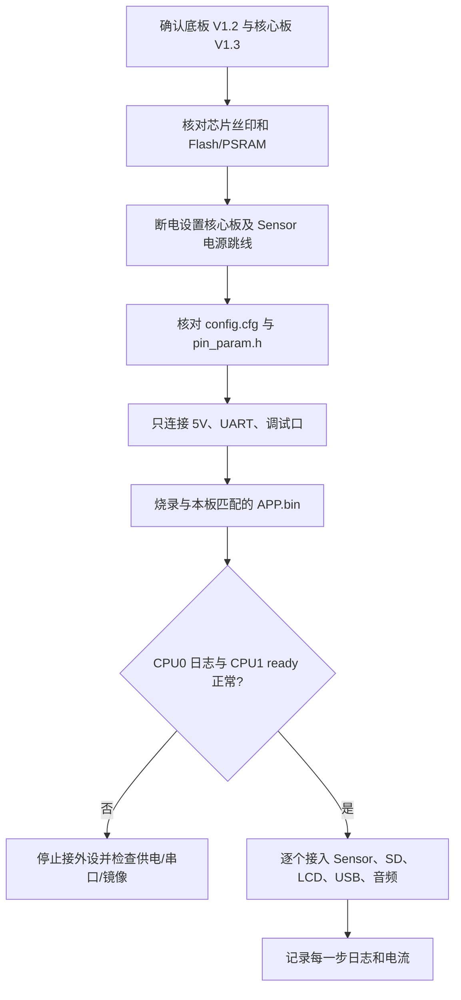

> [!WARNING]
> 不要带电插拔核心板、MIPI/DVP Sensor、LCD 或改变电压跳线。首次点亮采用逐个外设接入法；出现异常电流、发热、异味或电源跌落应立即断电。

---

## 3. TXW82x 硬件设计要点

以下规则依据官网 [TXW82x 硬件设计指南][web-hw-guide] 和 [TXW828-E016FL 数据手册][web-datasheet] 整理，用于软件配置和硬件联调；学习板还应结合 [TXW82x 学习板资料包 V1.2][web-dev-board]。TXW826 目标可同时查阅官网 [TXW826 Hardware Design Doc][web-txw826-hw]，具体数值以目标料号最新受控版本为准。

### 3.1 电源、时钟和启动

- 外置 40MHz 高速晶振为必选，推荐负载电容 15pF，工作温度范围精度 ±10ppm；匹配后射频频偏要求不超过 ±10ppm。
- 外部 32.768kHz 晶振为可选；联网产品可通过网络校时，但 RTC 精度、掉电保持和唤醒需求仍需单独评估。
- 3.3V 电源纹波应不大于 50mV，主路径按至少 1A、最窄处至少 500mA 设计；VDD 外部 DCDC 纹波应不大于 30mV。
- 多路 3.3V 共源时采用星形拓扑，退耦电容靠近管脚并提供短回流路径；EPAD 必须良好接地和散热。
- 无内置 Flash 型号支持 SPI/eMMC 等启动介质，BOOT IO 与镜像生成配置必须一致。

> [!WARNING]
> 不得凭软件宏推断供电和启动介质。错误的 BOOT 电平、电源电压或 Flash 电压会导致无法启动，严重时造成硬件损坏。

### 3.2 摄像头、显示和高速接口

| 接口 | 设计边界 |
| --- | --- |
| MIPI CSI | 最多两路 1-lane，或单路 2-lane；差分阻抗 100Ω；整对整组使用；建议长度不超过 15cm |
| DVP | VCC1 决定 PB6…PB15、PC0…PC2 电平；MCLK/PCLK 预留 10Ω～51Ω 串阻及调试电容 |
| MIPI DSI | QFN80 支持 1/2-lane；一组管脚用于 DSI 后，同组未用管脚也不能当然作为普通 GPIO |
| USB | DP/DM 差分阻抗 90Ω，参考层连续，走线尽量短、过孔尽量不超过 2 个 |
| SD | CMD/DATA 相对 CLK 等长误差控制在 ±100mil，走线建议小于 10cm，卡座侧放置 ESD |
| RMII | 主控与 PHY 数据线预留 22Ω 端接，时钟在 PHY 侧预留 RC |

> [!WARNING]
> MIPI 差分对、USB DP/DM、RF 和高速时钟不允许用普通 GPIO 经验随意换脚、飞线或跨分割参考平面。软件能够复用引脚不等于硬件信号完整性满足要求。

### 3.3 音频、射频和调试接口

- MIC 差分线按类差分布线，两侧包地，远离 RF、DCDC、晶振和 Audio PA；偏置网络按 MIC 规格计算。
- LOUTP/LOUTN 为差分输出，外接功放增益必须按功放规格设计；PA MUTE 时序与软件启动/休眠同步。
- RF 走线按 50Ω 单端阻抗、短直、连续参考地设计，芯片端预留 π 型匹配，天线侧布置 ESD。
- 调试口 使用 PA10/TMS、PA9/TCK，连接 CKLink 时参考电压接 3.3V；调试期间不要让这两脚被其他外设强驱动。
- UART 外接工具应防止经 IO 反向漏电；建议 TX/RX 串 1kΩ，RX 按指南增加 10kΩ 上拉及合适二极管。

> [!WARNING]
> VCMAU 是音频共模输出，只能按设计指南去耦，禁止作为其他电路电源。AGND 与系统地按参考设计单点连接，随意共地或分割可能引入底噪、啸叫和 RF 串扰。

### 3.4 硬件与软件联合评审流程

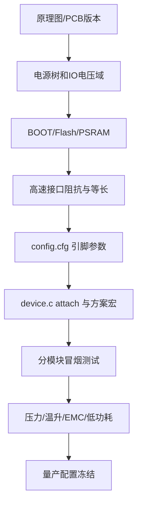

> [!IMPORTANT]
> 原理图、PCB、BOM、`config.cfg`、`pin_param.h`、工程宏和量产烧录配置必须形成同一版本基线。任一项变更都要重新执行受影响接口的电气和功能回归。

---

## 4. 快速开始

首次接触 TXSDK 时可先阅读 [TXSDK 开发入门指南][web-getting-started]；本章的工程路径、双核构建顺序和产物名称仍以当前 FPV 发布包为准。

### 4.1 所需软件

- Windows 开发环境；
- C-SKY CDK，需包含 `cdk-make.exe`、编译器、链接器和 CKLink 调试组件；
- CKLink 调试器及驱动；
- 串口终端；
- 与板卡和 Flash 型号匹配的正式下载/量产工具。

需要在 Linux 主机建立命令行构建环境时，参阅 [泰芯 SDK Linux 环境编译简要说明][web-linux-build]，并逐项映射本发布包实际的 C-SKY 工具链、工程配置和后处理脚本。

> [!CAUTION]
> 本文示例假定 CDK 位于 `Z:\C-SKY\CDK`。若安装位置不同，只替换可执行文件路径，不要移动 SDK 内的工程相对路径，否则 CDK 工程中的大量相对路径会失效。

> [!IMPORTANT]
> Linux 编译指南提供环境搭建方法，不代表 Windows CDK 命令可以原样复制到 Linux。必须确认工具链版本、大小写敏感路径、脚本执行权限和 Core→App 后处理结果一致。

### 4.2 首次构建

进入本发布包根目录，即能看到 `csky/`、`libs/`、`project/` 和 `sdk/` 的目录，然后依次执行：

```powershell
& 'Z:\C-SKY\CDK\cdk-make.exe' `
  -p '.\project\txw82xCore\txw82xCore.cdkproj' `
  -d build -c FLASH

& 'Z:\C-SKY\CDK\cdk-make.exe' `
  -p '.\project\txw82xApp\txw82xApp.cdkproj' `
  -d build -c FLASH
```

> [!IMPORTANT]
> 构建顺序必须是 `txw82xCore → txw82xApp`。App 的链接和打包会使用本次 Core 的镜像大小、BSS 边界和 CRC 结果。

最终用于整机下载的是：

```text
project/txw82xApp/APP.bin
```

> [!WARNING]
> 不要把发布包预置的 `project/txw82xApp/txw82xcore.bin` 当成刚构建的 Core。每次修改 CPU1、Wi-Fi Core 或 Core 配置后都应重新执行完整顺序，否则最终 `APP.bin` 可能仍包含旧 Core。

### 4.3 首次运行检查

1. 先只连接电源、调试串口和 CKLink。
2. 下载与板卡匹配的最新 `APP.bin`。
3. 保存完整启动日志，确认 CPU0 启动。
4. 确认日志出现 `CPU1 ready!`。
5. 确认 PSRAM、设备表、参数区和网络初始化没有首个错误。
6. 再逐个接入 Sensor、TF 卡、LCD、USB 和音频外设。

---

## 5. SDK 目录和交付边界

在线延伸阅读：[TXW82x SDK 架构与配置说明][web-sdk-arch]、[TXW82x SDK 框架原理说明][web-sdk-framework]。本文中的目录、工程和库边界仍以当前发布包实际文件为准。

```text
TXW82x_FPV-v2.7.1.7-44398/
├─ csky/                 CSI Core、DSP、Rhino 内核和 C-SKY 适配
├─ doc/                  本 SDK 文档目录
├─ libs/                 CPU0/CPU1 预编译静态库
├─ ohos/kernel/liteos_m/ LiteOS-M 源；当前 FLASH 配置排除
├─ project/
│  ├─ txw82x.cdkws       双工程工作区
│  ├─ txw82xCore/        CPU1 工程、配置和后处理脚本
│  └─ txw82xApp/         CPU0 工程、板级代码、参数和最终固件
├─ sdk/
│  ├─ chip/txw82x/       启动、异常、Cache、双核和引脚复用
│  ├─ include/           公共 HAL、设备、OSAL 和组件头文件
│  ├─ hal/               公共 HAL 转发实现
│  ├─ driver/            本发布包开放的驱动实现
│  ├─ lib/               网络、文件系统、多媒体、音频、UI 等组件
│  ├─ app/               可复用产品功能
│  └─ demo/              可选择的产品方案
└─ tools/                辅助分析工具
```

### 5.1 源码与预编译库

当前包不是所有模块都以源码交付。`libs/` 包含 Core、Wi-Fi、ISP、H.264、USB、SD、Audio、OTA 等静态库，例如：

- CPU0：`libcore0.a`、`libvideo0.a`、`libh2640.a`、`libisp.a`、`libusb0.a`、`libsd0.a`；
- CPU1：`libcore1.a`、`liblmac.a`、`libwifi.a`、`libwifi_wpa3.a`、`libuble1.a`；
- 公共：`libcommon0.a`、`libnetutils0.a`、`libmpool0.a` 等。

> [!CAUTION]
> 当前包不是全源码交付。修改前必须先确认目标符号来自开放源码还是预编译库。

因此，以下原则很重要：

- 修改未生效时，先确认该符号来自源码还是静态库；
- 公共头文件存在不等于驱动实现已开放；
- 不要复制或改名静态库来绕过符号冲突；
- 需要修改闭源模块时，应申请匹配当前版本的库或源码，不应使用其他 SDK 版本的库替换。

### 5.2 示例

本包的验证入口主要是 `sdk/demo/`、`sdk/app/test_demo/`、公共 HAL 以及产品工程。文档不会把未交付的测试文件描述为可直接执行入口。

---

## 6. 工程、构建和固件生成

构建前建议先阅读官网 [TXW82x SDK 架构与配置说明][web-sdk-arch]；本节命令、双工程顺序和后处理产物以当前 FPV SDK 脚本为准。

### 6.1 CDK 工作区

可以在 CDK 中打开：

```text
project/txw82x.cdkws
```

工作区 `Debug` 配置把 `txw82xCore` 和 `txw82xApp` 都映射到 `FLASH`。即使使用 IDE，也要先构建 Core，再构建 App。

### 6.2 清理工程

```powershell
& 'Z:\C-SKY\CDK\cdk-make.exe' `
  -p '.\project\txw82xCore\txw82xCore.cdkproj' `
  -d clean -c FLASH

& 'Z:\C-SKY\CDK\cdk-make.exe' `
  -p '.\project\txw82xApp\txw82xApp.cdkproj' `
  -d clean -c FLASH
```

切换产品方案、链接脚本、静态库或大量条件宏后，建议执行完整清理并重建两工程。

### 6.3 Core 后处理流程

`project/txw82xCore/BuildBIN.sh` 在链接后执行：

```text
Obj/*.elf、Lst/*.map、Obj/*.ihex
  → project.elf / project.map / project.hex
  → sdktools binscript
  → sdktools makecode
  → sdktools crc
  → txw82xcore_crc.bin
  → 复制为 ../txw82xApp/txw82xcore.bin
  → 根据 Core 镜像大小和 Core BSS 末地址更新 App 链接脚本
```

> [!WARNING]
> 不要手工固定 Core 预留大小。该步骤会由 `gcc_csky.ld.i` 生成中间链接脚本，再更新 `project/txw82xApp/utilities/gcc_csky.ld`；错误的预留大小可能使 Core 覆盖 App 或共享 SRAM。

### 6.4 App 后处理流程

`project/txw82xApp/BuildBIN.sh` 执行：

```text
先校验 txw82xcore.bin
  → 合并 Core 与 App HEX/BIN
  → 写入代码参数
  → 根据 config.cfg 和 pin_param.h 写入板级引脚参数
  → 合入 psram.bin
  → 输出 APP.bin
```

Core 校验失败时脚本会打印：

```text
!!!txw82xcore code is distroyed!
```

> [!WARNING]
> 出现 Core 校验失败时不要只重建 App。应先清理并重建 Core，再重建 App。

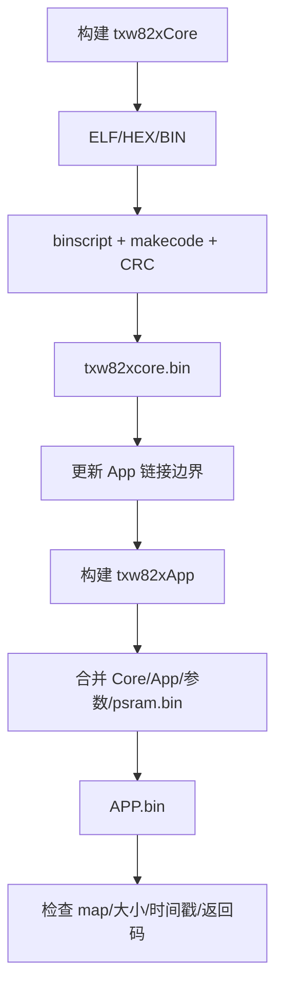

### 6.5 应检查的构建产物

```text
project/txw82xCore/project.elf
project/txw82xCore/project.map
project/txw82xCore/project.hex
project/txw82xCore/txw82xcore_crc.bin
project/txw82xApp/txw82xcore.bin
project/txw82xApp/project.elf
project/txw82xApp/project.map
project/txw82xApp/project.hex
project/txw82xApp/APP.bin
```

> [!WARNING]
> 构建日志出现未定义符号、区域溢出、Core CRC 失败或后处理失败时，不能仅凭 ELF 已生成判断成功。交付固件前至少核对返回码、时间戳、文件大小、map 区域占用和 App 中 Core 的更新时间。

### 6.6 下载与调试

工程预置 CKLink/ICE 配置，时钟为 12MHz，并带有 `utilities/gdb.init`。这些脚本会关闭看门狗或写芯片控制寄存器，只能用于匹配的 TXW82x 板卡和当前工程。

> [!WARNING]
> 当前发布包没有提供一份可独立确认所有 Flash 型号的烧录说明。量产或更换 Flash 时，应使用正式发布工具和目标板配置，不要仅根据 `makecode.ini` 推断物理 Flash 容量、擦写范围或安全配置。

---

## 7. 配置体系和方案选择

### 7.1 配置优先级

配置从产品到系统分三层：

1. `project/txw82xApp/project_config.h`：选择产品方案；
2. `sdk/demo/**/**config.h`：方案级功能、时钟、内存、Sensor 和业务开关；
3. `project/txw82xApp/sys_config.h`：系统默认值，仅在方案未定义时生效。

> [!IMPORTANT]
> `sys_config.h` 已明确要求优先在产品配置中覆盖宏。除修复全 SDK 默认行为外，不应直接把产品开关写进 `sys_config.h`。

### 7.2 `CUSTOMER_ID` 方案表

不同发布包和产品方案的选择关系可对照官网 [TXW82x SDK 选型表][web-sdk-selection]；最终仍需核对当前 `project_config.h` 中实际存在的分支。

当前 `project_config.h` 默认：

```c
#define CUSTOMER_ID 5
```

| ID | 方案 | 配置文件 | 主要用途 |
| --- | --- | --- | --- |
| 1 | AI Voice | `sdk/demo/ai_demo/coze_demo/ai_dialogue/voice_config.h` | Coze AI 语音对话 |
| 2 | AI Vision | `sdk/demo/ai_demo/coze_demo/ai_dialogue/vision_config.h` | Coze AI 视觉对话 |
| 3 | AI Alarm Clock | `sdk/demo/ai_demo/coze_demo/ai_alarm_clock/ai_alarm_clock_config.h` | SPI LCD、LVGL、语音/网络服务 |
| 4 | ISP Tuning | `sdk/demo/isp_tuning_demo/isp_tuning_config.h` | Sensor/ISP 调试 |
| 5 | 720P IPC | `sdk/demo/ipc_720p_demo/ipc_720p_config.h` | 当前默认方案 |
| 6 | LCD 720P | `sdk/demo/lcd_720P_demo/lcd_720p_config.h` | MIPI LCD、播放和 LVGL |
| 7 | 720P Sleep | `sdk/demo/ipc_Sleep_720P/ipc_720p_sleep_config.h` | 低功耗 720P IPC |
| 8 | 1080P IPC | `sdk/demo/ipc_1080p_demo/ipc_1080p_config.h` | 1080P IPC |
| 9 | Battery Camera 1080P | `sdk/demo/battery_camera_1080p/battery_camera_1080p_config.h` | 电池摄像机 |

AI 语音、视觉和闹钟方案涉及 LLM 服务接入、会话及数据处理时，可结合 [TXSDK LLM 开发指南][web-llm]；本版本 Coze/网易示例的宏、目录和内存配置仍以当前源码为准。

> [!CAUTION]
> 网易示例配置也随包提供，但 `project_config.h` 当前注释掉了相应 include。切换供应方时必须同时核对鉴权参数、TLS/时间、内存和 UI，不要只切换一个宏。

### 7.3 方案配置摘要

| 方案 | CPU 时钟 | Wi-Fi 默认 | 显示/播放器 | 典型特点 |
| --- | ---: | --- | --- | --- |
| AI 闹钟 | 240MHz | STA | ST7789 SPI、LVGL、[TXMPlayer][web-sdk-framework] | 语言识别和打断、SNTP、Coze、JPEG 编解码 |
| AI 语音/视觉 | 192MHz | STA | 视觉版含 ST7701S MIPI | 语言识别和打断、TX/RX 聚合，网络 AI |
| 720P IPC | 192MHz | AP（继承系统默认） | 无 | 720P 主流、640 辅流、RTSP/录卡 |
| 1080P IPC | 192MHz | AP（继承系统默认） | 无 | 1080P 主流、720P 辅流 |
| 720P Sleep | 192MHz | STA | 无 | Wi-Fi低功耗保活 |
| Battery 1080P IPC | 192MHz | STA | 无 | Wi-Fi低功耗保活 |
| LCD 720P | 192MHz | AP（继承系统默认） | ST7701S MIPI、LVGL、[TXMPlayer][web-sdk-framework] | H.264/JPEG 解码和显示 |

> [!IMPORTANT]
> 切换 `CUSTOMER_ID` 后必须重新构建 App；涉及 Core 资源、Wi-Fi 聚合或无线安全特性时应同时重建 Core。

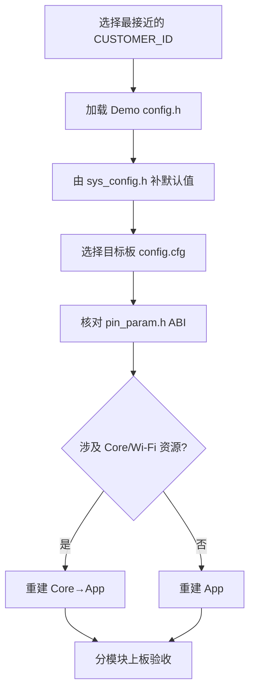

---

## 8. 启动流程和双核架构

框架层概念可在线参阅 [TXW82x SDK 框架原理说明][web-sdk-framework] 和 [TXW82x SDK 架构与配置说明][web-sdk-arch]；下述调用链由本发布包 `system0.c`、`system1.c` 和双工程入口解析得到。

### 8.1 总体结构

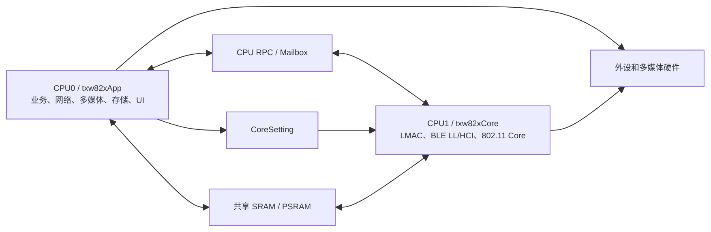

### 8.2 CPU0 系统启动

`sdk/chip/txw82x/system0.c:pre_main()` 的实际顺序为：

```text
保存 Boot Loader 信息
  → 初始化 CPU0 SRAM heap
  → 自动探测并初始化 PSRAM
  → 初始化内核
  → 初始化低功耗回调
  → dev_init() + project/device.c:device_init()
  → 打印 PSRAM 信息
  → 初始化 eFuse/芯片权限
  → 启动 CPU1，等待 cpu1_ready
  → 建立 MAIN workqueue
  → 调用 project/txw82xApp/main.c:main()
  → 启动内核调度
```

CPU0 以 `0x10001000` 作为 CPU1 复位运行地址。CPU1 未置位 `CoreSetting->cpu1_ready` 时，CPU0 会一直等待，因此“只有 CPU0 早期日志”通常应从 Core 镜像、共享内存和 CPU1 初始化排查。

### 8.3 CPU1 资源由 CPU0 提供

CPU0 启动 CPU1 前填写 `CoreSetting`，默认包括：

| 资源 | 默认值 | 来源 |
| --- | ---: | --- |
| CPU1 heap | 40KiB SRAM | `CONFIG_CORE_HEAP_SIZE` |
| LMAC RX buffer | 10KiB SRAM | `CONFIG_CORE_RXBUF_SIZE` |
| Wi-Fi SKB pool | 200KiB PSRAM | `CONFIG_CORE_SKB_POOL_SIZE` |
| VIF/BSS/STA 上限 | 8 / 16 / 4 | `system0.c` |
| CPU1 时钟 | 等于方案的 `DEFAULT_SYS_CLK` | `CONFIG_CORE_CPU_CLK` |

打开 `WIFI_RX_AGG_EN` 时，`sys_config.h` 明确提示 RX buffer 小于 18KiB 不推荐。若方案打开 RX 聚合，应同步提高 `CONFIG_CORE_RXBUF_SIZE` 并核对 SRAM map，而不是只修改 Wi-Fi 宏。

### 8.4 CPU1 初始化

`project/txw82xCore/main.c` 的主要流程：

```text
cpu_rpc_init(CPU1_MSGBOX_BASE)
  → sys_atcmd_init()
  → skbpool_init()
  → lmac_bgn_init()
  → 802.11w / Multi-MAC / RX reorder（按配置）
  → ble_ll_init() + bt_hci_init()
  → ieee80211_init()
  → dsleep1_init()
  → CoreSetting->cpu1_ready = 1
```

高频 RX、TX、BSS 更新、Beacon idle 和 TX status 事件在 CPU1 本地截断，不逐个传给 CPU0；其他 802.11 事件通过 RPC 上送。

### 8.5 CPU0 应用初始化

`project/txw82xApp/main.c:main()`：

```text
看门狗配置
  → CPU0 RPC
  → heap 信息
  → syscfg 参数读取
  → 系统事件池（32 个节点）
  → AT 命令
  → MSI Core 与编解码器
  → Wi-Fi / BLE / lwIP
  → VFS
  → sys_app_init() 选择产品 Demo
  → usr_app_init() 用户扩展
  → 注册总事件处理器
  → 周期状态和喂狗 work
```

Wi-Fi 测试模式会进入单独分支，不启动正常产品业务。

---

## 9. 内存、Cache 和并发

### 9.1 内存池

| 区域 | 常用接口 | 典型用途 |
| --- | --- | --- |
| CPU0 SRAM heap | `os_malloc()`、`os_zalloc()` | 任务、控制对象、低延迟小块 |
| CPU0 PSRAM heap | `os_malloc_psram()` | 网络大缓存、一般大对象 |
| AV SRAM heap | `video_sram_init()` / AV heap API | VPP/H.264 等时序敏感数据 |
| AV PSRAM heap | `video_psram_init()` / AV PSRAM API | 帧、码流和显示缓存 |
| CPU1 SRAM | CPU0 在启动时分配 | CPU1 heap、LMAC RX |
| CPU1 PSRAM | CPU0 在启动时分配 | Wi-Fi SKB pool |
| Audio RPC PSRAM | `aurpc_psram_heap_init()` | 音频模块缓存，默认 30KiB |

默认 720P 方案分配 `7MiB + 512KiB` AV PSRAM 和 `100KiB` AV SRAM。该值不是额外物理内存，而是从系统可用内存中划出的专用池；修改时要与 CPU1 SKB、lwIP、文件系统、AI、LVGL 和普通 PSRAM heap 一起核算。

### 9.2 链接和地址边界

当前链接脚本表明：

- CPU0 XIP 从 `0x10000000` 开始；
- CPU1 XIP 从 `0x10001000` 开始，前 4KiB 留给 CPU0 向量区；
- CPU1 Core 的实际大小和 BSS 末地址会在 Core 构建后回填到 App 链接脚本；
- PSRAM 在 CPU0 DBUS 侧使用 `0x28000000` 映射；
- `CoreSetting`、Loader 参数和固件信息占用保留 SRAM，不能作为普通 heap 使用。

> [!WARNING]
> 不要根据文档中的地址手工扩大段，也不要占用 `CoreSetting`、Loader 参数或固件信息使用的保留 SRAM；应以本次 `project.map` 为最终证据。

### 9.3 Cache、DMA 和所有权

> [!WARNING]
> Cache 维护、DMA 地址域或 Framebuff 所有权处理错误，可能造成随机花屏、码流损坏、越界访问或偶发死机。相关修改必须做并发和长稳验证。

- DMA 缓冲区要满足设备要求的对齐、地址域和生命周期；
- CPU、DMA、CPU1 或硬件编解码器共享缓冲区时，需要按方向执行 clean/invalidate；
- ISR 中不要分配大内存、等待互斥锁、访问文件系统或执行网络阻塞调用；
- MSI/Framebuff 传递必须遵守引用计数和“谁释放”的约定，成功交给下游后不要继续写原帧；
- 大数据放 PSRAM 能节省 SRAM，但会增加访问延迟和总线压力，视频热点数据应按方案实测。

### 9.4 OSAL

公共 OS 抽象位于 `sdk/include/osal/`：

| 能力 | 头文件 | 常用入口 |
| --- | --- | --- |
| 任务 | `task.h` | `os_task_create()`、`os_task_destroy()` |
| Workqueue | `work.h` | `OS_WORK_INIT`、`os_run_work()`、`os_run_work_delay()` |
| 互斥/信号量 | `mutex.h`、`semaphore.h` | 线程互斥和 ISR/任务同步 |
| 消息/事件 | `msgqueue.h`、`event.h`、`condv.h` | 模块间异步通信 |
| 内存/字符串 | `string.h` | `os_malloc()`、`os_malloc_psram()` 等 |

> [!CAUTION]
> 产品组件应使用 OSAL，不要依赖 Rhino 内部任务控制块。默认方案另建 `user_workqueue` 和 `sd_workqueue`，避免网络、SD 写入或算法阻塞 MAIN workqueue。

---

## 10. 应用开发

### 10.1 最小接入

应用入口、工程添加和基础组件使用可先对照 [TXSDK 开发入门指南][web-getting-started]；下述代码位置是当前 FPV 双工程发布包的实际入口。

最小用户初始化入口是：

```c
/* project/txw82xApp/main.c */
__init static void usr_app_init(void)
{
    my_product_init();
}
```

> [!IMPORTANT]
> 新增 `.c` 文件后还必须把文件加入 `txw82xApp.cdkproj` 的 `FLASH` 配置；仅把文件复制进目录并不会自动参与构建。建议把实现放在 `sdk/app/<my_product>/`，用户入口只保留调用。

初始化函数应快速返回。长时间循环、Socket 阻塞、Sensor 重试和文件写入应放到独立 task/workqueue。

### 10.2 创建新产品方案

推荐步骤：

1. 从最接近的 `sdk/demo/` 方案复制配置和初始化骨架；
2. 创建独立 `<product>_config.h`，只覆盖产品需要的宏；
3. 在 `project_config.h` 增加新的 `CUSTOMER_ID` 分支；
4. 在 `sys_app_init()` 增加唯一的产品初始化入口；
5. 将新源文件加入 CDK 工程；
6. 选择匹配板卡的 `config.cfg`；
7. 先验证 Core ready、heap、Sensor、ISP/VPP，再逐步加入编码、网络、录卡和 UI；
8. 完整构建 Core→App，并保存 map 和启动日志。

> [!WARNING]
> 同一固件不应同时定义多个顶层 Demo 宏，否则可能重复初始化同一设备、内存池或工作队列。

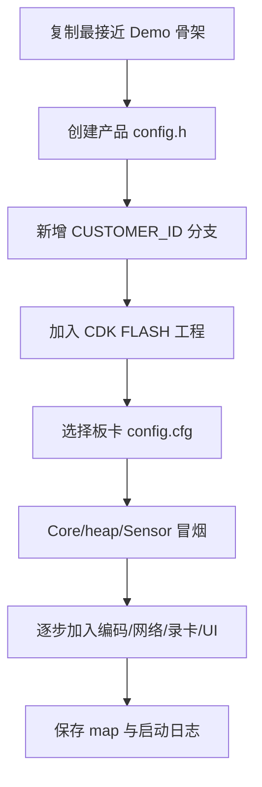

### 10.3 运行时参数

`project/txw82xApp/syscfg.c` 和 `project/txw82xApp/syscfg.h` 定义 `struct sys_config sys_cfgs`，通过公共 `syscfg_init()` 从名为 `syscfg` 的参数项读取。读取失败时调用 `syscfg_default()`。

运行时参数包括：

- MAC、Wi-Fi 模式、SSID、密码、PSK、信道和带宽；
- AP/STA、中继和 RMesh 参数；
- IPv4/IPv6、DHCP Client/Server 参数；
- AI 对话相关持久字段。

> [!WARNING]
> 参数结构前部带 magic/CRC 等兼容字段，新字段应追加到尾部，不能随意插入或重排，否则已量产设备的参数区可能不兼容。

修改后调用 `syscfg_save()` 保存；需要立即生效时还要按模块调用 `wificfg_flush()`、`netcfg_flush()` 或重启接口。

### 10.4 系统事件

公共事件定义位于 `sdk/include/lib/common/sysevt.h`。CPU0 初始化 32 个事件节点，并注册总处理器 `sys_event_hdl()`。

当前工程处理 Wi-Fi 连接/断开、DHCP 完成、NTP、深睡心跳、LTE/RNDIS、设备热插拔和配网事件。事件回调中只做状态更新和投递；耗时逻辑应提交到 workqueue。独立模块使用 `sys_event_take()` 后应在退出时 `sys_event_untake()`，每次注册都会消耗 heap。

### 10.5 第三方库移植

移植前先从 [TXW82x 官方文档列表][web-doc-list] 检查是否已有对应在线指南，并确认库的许可证、CPU 架构、ABI、大小端、硬/软浮点、线程和文件/Socket 依赖，再决定源码编译或引入静态库。CPU0 为 E804DF 硬浮点，不能直接链接为其他架构、其他浮点 ABI 或其他 SDK 版本生成的库（建议在当前SDK版本生成库）。

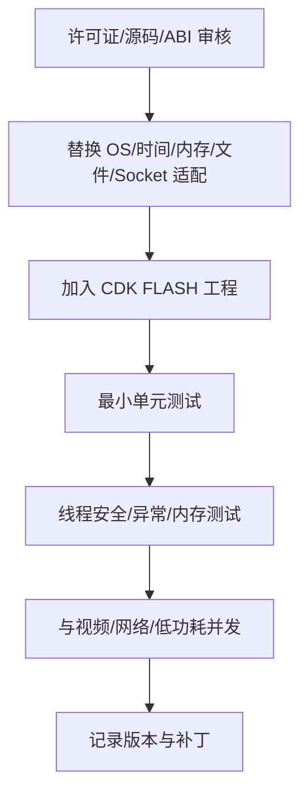

> [!WARNING]
> 不要用“能链接”判断二进制兼容。浮点 ABI、结构体对齐、编译选项或 C++ 运行库不一致可能在运行时静默破坏栈和数据；闭源第三方库还必须保留许可证和安全漏洞升级机制。

---

## 11. 默认 720P IPC 方案

视频组件的通用使用方法见官网 [TXW82x SDK 视频应用功能使用说明][web-sdk-video]；本章分辨率、Sensor 和初始化顺序以当前 `ipc_720p_demo` 为准。

### 11.1 功能基线

当前 `CUSTOMER_ID=5` 对应：

| 功能 | 默认配置 |
| --- | --- |
| Sensor | `DEV_SENSOR_GC1084=1`，MIPI CSI 单主模式 |
| 主码流 | H.264，1280×720@15fps（帧率最终由 Sensor 表决定） |
| 辅码流 | H.264，640×360@15fps |
| 拍照 | JPEG，1280×720，默认 30 个 16KiB 节点 |
| 录卡 | MP4：主码流 + AAC，音频 8kHz/16bit |
| 网络预览 | RTSP 辅码流，默认 URL `rtsp://<设备IP>:554/h264?1` |
| 文件系统 | FAT32/exFAT 能力由 FatFs 配置决定 |
| 最大单个 MP4 | 100MiB |
| CPU 时钟 | 192MHz |
| AV PSRAM | 7.5MiB |
| AV SRAM | 100KiB |
| Wi-Fi | AP 默认、TX 聚合开、RX 聚合关 |

上述分辨率和帧率是方案注释中的目标值，不等于所有 Sensor、码率、网络距离和 SD 卡条件下的保证值。

### 11.2 初始化调用链

```text
ipc_720p_demo_init()
  ├─ app_print_init()
  ├─ app_heap_init()
  │    ├─ video_psram_init(7.5MiB)
  │    └─ video_sram_init(100KiB)
  ├─ app_power_init()
  ├─ user_workqueue_init() + sd_workqueue_init()
  ├─ app_hardware_init()
  │    ├─ app_sd_init()
  │    ├─ iic_thread_init()
  │    ├─ sensor_info_init()
  │    ├─ mipi_csi_hardware_config()
  │    ├─ isp_cfg_dev()
  │    ├─ ircut_init()
  │    ├─ vpp_cfg()
  │    └─ app_audio_init(8000, 16000)
  ├─ app_function_init()
  │    ├─ Scale/JPEG 锁和内存
  │    ├─ Gen420 MSI
  │    ├─ cJSON / eloop
  │    ├─ H.264 主辅码流
  │    └─ 自动 JPEG 拍照
  └─ app_user_init()
       ├─ spook_init()       RTSP
       └─ config_Viidure(80) 录卡/产品逻辑
```

### 11.3 视频数据流

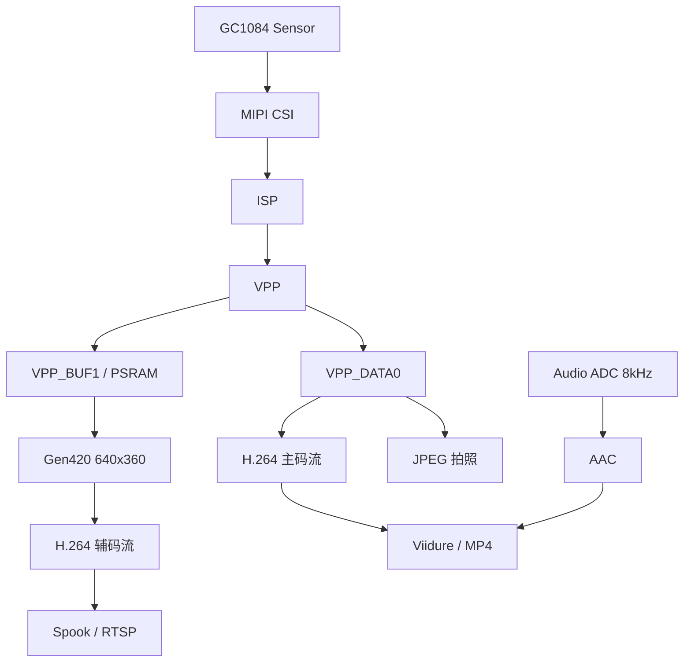

定位视频问题时按 Sensor 电源/I2C → CSI 帧 → ISP → VPP → 编码器 → MSI 队列 → RTSP/SD 的顺序查首个失败点。

---

## 12. Wi-Fi、BLE 和网络

专题资料可直接查阅 [TXSDK Wi‑Fi 开发指南][web-wifi]、[TXSDK BLE 开发指南][web-ble]、[TXW8xx SDK BLE 配网开发指南][web-ble-provisioning] 和 [TXSDK 网络应用开发指南][web-network]；协议模式、API 和默认参数仍需与当前 SDK 头文件及 `wifi.c`、`ble.c`、`network.c` 交叉核对。

### 12.1 初始化关系

CPU1 完成 LMAC、BLE LL/HCI 和 802.11 Core 初始化；CPU0 的 `wifi.c`、`ble.c`、`network.c` 建立接口、lwIP netif 和应用协议。

CPU0 正常模式顺序为：

```text
sys_wifi_init()
  → sys_ble_init()
  → sys_network_init()
  → 产品业务
```

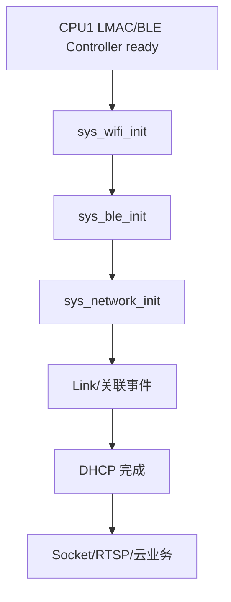

> [!CAUTION]
> 默认单 Wi-Fi netif 名为 `w0`；启用 Ethernet 时使用 `e0`。不要在收到 Wi-Fi connected 事件后用固定延时猜测网络就绪，应等待 DHCP 完成事件。

### 12.2 系统默认网络参数

在方案未覆盖时：

| 参数 | 默认值 |
| --- | --- |
| Wi-Fi 模式 | AP |
| SSID 前缀 | `82X_`，默认参数会追加 MAC 后三字节 |
| 密码 | `12345678` |
| 模式 | 802.11n |
| 信道 | 自动 |
| 带宽 | 20MHz |
| AP 地址 | `192.168.1.1/24` |
| DHCP 池 | `192.168.1.100`～`192.168.1.254` |
| DHCP 租期 | 7200 秒 |

> [!WARNING]
> 默认口令 `12345678` 只适合开发验证，禁止直接用于量产。产品必须修改口令并设计安全的首次配网、凭据保存和恢复流程。

### 12.3 常用 Wi-Fi 开关

Wi‑Fi 模式、扫描、连接、安全、事件和接口使用可结合 [TXSDK Wi‑Fi 开发指南][web-wifi]，但 CPU0/CPU1 的宏组合必须以本发布包为准。

- `WIFI_AP_SUPPORT`、`WIFI_STA_SUPPORT`：AP/STA 能力；
- `WIFI_RMESH_SUPPORT`：RMesh；
- `WIFI_TX_AGG_EN`、`WIFI_RX_AGG_EN`：聚合；
- `WIFI_PREVENT_PS_MODE_EN`：尽量阻止 STA 休眠；
- `WIFI_FEM_CHIP`：外置 FEM；
- `WIFI_MODULE_MULTI_MAC_EN`、`WIFI_MODULE_RX_REORDER_EN`：CPU1 按需模块；
- `SYS_APP_DHCPD`、`SYS_APP_SNTP`：DHCP Server、SNTP；
- `SYS_APP_BLENC`：BLE/广播配网入口。

Core 工程默认开启 802.11w、SAE、OWE 及 WPA 加密适配。改变安全特性时要同时核对 CPU0 配置、CPU1 库、内存和互通测试。

### 12.4 BLE 配网

CPU1 始终建立 BLE LL/HCI 基础；CPU0 `sys_ble_init()` 初始化 BLE Demo。`SYS_APP_BLENC` 非零时，`sys_ble_netconfig_init()` 开启配网和 Wi-Fi/BLE 共存，并在收到凭据后切换到 STA。BLE 通用接口参阅 [TXSDK BLE 开发指南][web-ble]，配网协议和接入流程参阅 [TXW8xx SDK BLE 配网开发指南][web-ble-provisioning]。

> [!CAUTION]
> 配网成功应以 Wi-Fi 连接和 DHCP 事件为准，再通过 GATT 通知结果；不要在仅收到 BLE 写入后就认为联网完成。

### 12.5 USB Cat.1 网络接入

USB Cat.1 模组的硬件连接、模组准备和应用步骤可在线参阅 [Cat.1 模组接入指南][web-cat1]。当前 SDK 的 USB Host 无线类位于 `sdk/lib/bus/rttusb/usbhost/class/`：通用 RNDIS 为 `rndis.c`，并包含 `quectel.c`、`chinamobile.c`、`yuge.c` 等模组适配入口。

接入时需同时核对：

- USB Host、VBUS 和设备检测已正确启用；
- `RT_USBH_WIRELESS`、`RT_USBH_WIRELESS_RNDIS` 及目标模组适配配置与工程一致；
- SIM、APN、模组 USB 网络模式和运营商网络正常；
- `SYSEVT_LTE_CONNECTED` 到达后，`project/txw82xApp/events.c` 才将 `l0` 设为默认网卡并启动 DHCP Client；
- Wi-Fi 与 Cat.1 共存时明确默认路由、DNS、已有 Socket 和断线切换策略。

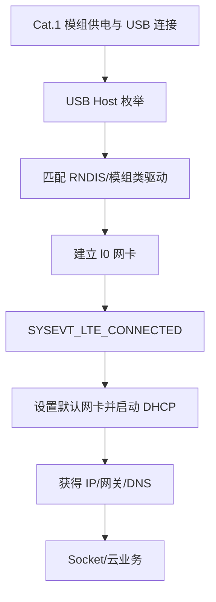

> [!WARNING]
> USB 枚举成功不等于 Cat.1 已联网。业务必须等待 LTE 连接事件和 `l0` 地址就绪；禁止用固定延时直接发起云连接。

> [!CAUTION]
> Cat.1 模组发射瞬间电流可能显著高于空闲电流。VBUS/外部供电、地回路、线材压降和过流保护必须按目标模组规格设计，不能默认由学习板 USB 口直接供电。

---

## 13. 多媒体开发

在线参考：[TXW82x SDK 视频应用功能使用说明][web-sdk-video]、[TXW82x SDK 框架原理说明][web-sdk-framework]。涉及本版本的默认分辨率、内存池和组件名称时，以当前 Demo 和源码为准。

### 13.1 主要层次

| 层次 | 目录 | 说明 |
| --- | --- | --- |
| 公共 HAL | `sdk/include/hal/`、`sdk/hal/` | ISP、VPP、H.264、JPEG、LCDC、DMA2D 等接口 |
| 设备对象 | `sdk/include/dev/`、`project/txw82xApp/device.c` | 基址、IRQ、DMA、ops 和设备 ID |
| 组件 | `sdk/lib/video/`、`sdk/lib/multimedia/`、`sdk/lib/audio/` | Sensor/CSI、MSI、编解码和音频库 |
| 可复用应用 | `sdk/app/` | video_app、audio_msi、gen420、screen、playback 等 |
| 产品方案 | `sdk/demo/` | 分辨率、内存和业务连接 |

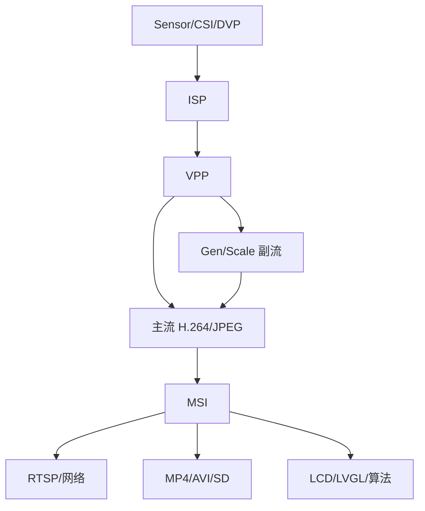

### 13.2 Sensor、CSI 和 ISP

标准摄像机方案先启动 I2C 线程和 Sensor 信息，再执行 `mipi_csi_hardware_config()`、读取实际宽高、配置 ISP。新增 Sensor 时至少核对：

- 电源、RESET、PWDN、MCLK；
- I2C 地址、寄存器表、帧率和曝光约束；
- MIPI lane 数、lane 顺序、P/N 极性和数据率；
- RAW/YUV 格式、Bayer 顺序和 ISP 参数；
- 单/双 lane Sensor 能否与当前自动识别逻辑共存。

当前配置注释明确指出：自动识别多个 Sensor 时，单 lane 与双 lane 混用可能需要修改 SDK 初始化逻辑。

### 13.3 VPP 和多码流

> [!CAUTION]
> 默认方案用 VPP BUF0 承载主路径，用 BUF1 在 PSRAM 中生成辅路径。`SUB_STREAM_WIDTH` 必须与 Sensor 宽高保持正确比例；高度由 SDK 计算。错误的尺寸或 stride 可能造成花屏、越界或编码异常。

修改辅码流时同时核对：

- VPP BUF1 是否使能；
- Gen420 输入和输出格式；
- H.264 第二路来源；
- PSRAM 带宽和 AV heap；
- RTSP 选择的是主流还是辅流。

### 13.4 H.264、JPEG 和 MSI

低层 HAL 位于 `sdk/include/hal/h264.h`、`jpeg.h`；产品通常应优先使用 `auto_h264_msi_init()`、`auto_jpg_msi_init()` 等组件入口，而不是直接逐寄存器配置硬件。

MSI 组件通过命名节点连接。调试时记录输入/输出帧率、队列水位、丢帧、编码长度、超时和 heap。H.264、JPEG、显示、Wi-Fi 和 SD 并发会共享 PSRAM/总线，不应只看编码器单项耗时。

### 13.5 LCD 和 LVGL

LCD 720P 方案启用 ST7701S MIPI、H.264/JPEG 解码、DMA2D、LVGL 和 [TXMPlayer][web-sdk-framework]；TXMPlayer 的框架原理和接入关系可通过该链接查阅。AI 闹钟方案使用 ST7789 SPI LCD。黑屏、花屏、偏色、闪屏、撕裂、方向或接口时序问题可结合 [TXW82x LCD FAQ][web-lcd-faq] 定位。

公共入口在 `sdk/demo/app_common.c`：

- `app_lcd_init()`：面板硬件和 LCD 驱动；
- `app_lvgl_init()`：注册 LVGL 内存钩子、获取 OSD 尺寸/旋转并启动 UI；
- 输入设备掩码支持按键和触摸。

黑屏时先用纯色 framebuffer 验证面板、电源、复位和时序，再检查视频层、OSD、LVGL 和播放器。

### 13.6 音频

默认 IPC 调用 `app_audio_init(8000, 16000)`：ADC 8kHz，Mixer/DAC 16kHz，并建立 30KiB Audio RPC PSRAM heap。音频组件包括 AAC、G.711、AMR、MP3、Opus、AEC/ANS/AGC/VAD、重采样和 I2S/PDM。

排查爆音或断续时依次核对采样率、位宽、通道、主从时钟、DMA 周期、Cache、buffer 水位和模拟电源/PA 控制。

---

## 14. 外设和公共 API

### 14.1 设备模型

`project/txw82xApp/device.c:device_init()` 把设备实例 attach 到全局设备表，应用通过 `dev_get(HG_*_DEVID)` 获取公共对象。当前注册覆盖：

- GPIO A～E、UART0/1/4/5/6、Timer、ADC、PWM、Capture；
- SPI0/1/2、QSPI/XSPI、I2C1/2、SPI NOR；
- M2M DMA、SD Host、USB 1.1/2.0；
- MIPI CSI0/1、DVP、ISP、VPP、H.264、JPEG0/1；
- Scale1/2/3、Gen420/422、PRC、Dual、CSC、OSD、DMA2D；
- LCDC、DSI、Audio ADC/DAC/ASRC/EQ/Fade、I2S、PDM；
- CRC、AES、SHA 和可选 GMAC/PHY。

> [!NOTE]
> attach 只表示对象存在，不代表协议栈或业务已启动。例如 CSI attach 后仍需 Sensor/MIPI 配置，USB attach 后仍需注册 Host/Device 类驱动。

### 14.2 常用 API 导航

| 模块 | 公共头文件 | 代表接口 |
| --- | --- | --- |
| GPIO | `sdk/include/hal/gpio.h` | `gpio_set_mode()`、`gpio_set_dir()`、`gpio_set_val()`、`gpio_request_pin_irq()` |
| UART | `sdk/include/hal/uart.h` | `uart_open()`、`uart_puts()`、`uart_gets()`、`uart_request_irq()` |
| I2C | `sdk/include/hal/i2c.h` | `i2c_open()`、`i2c_set_baudrate()`、`i2c_read()`、`i2c_write()` |
| SPI | `sdk/include/hal/spi.h` | `spi_open()`、`spi_read()`、`spi_write()`、`spi_set_cs()` |
| SPI NOR | `sdk/include/hal/spi_nor.h` | `spi_nor_read()`、`spi_nor_write()`、`spi_nor_sector_erase()` |
| Timer | `sdk/include/hal/timer_device.h` | `timer_device_open()`、`timer_device_start()`、`timer_device_stop()` |
| PWM/Capture | `sdk/include/hal/pwm.h`、`capture.h` | `pwm_init/start()`、`capture_init/start()` |
| ADC/RTC | `sdk/include/hal/adc.h`、`rtc.h` | `adc_get_value()`、`rtc_get_time()`、`rtc_set_time()` |
| I2S/PDM | `sdk/include/hal/i2s.h`、`pdm.h` | `i2s_open/read/write()`、`pdm_open/read()` |
| DMA2D | `sdk/include/hal/dma2d.h` | `dma2d_memcpy()`、`dma2d_convert()`、`dma2d_mixture()` |
| H.264/JPEG | `sdk/include/hal/h264.h`、`jpeg.h` | 硬件控制；产品优先使用上层 MSI |
| LCDC/DSI | `sdk/include/hal/lcdc.h`、`dsi.h` | 面板时序、视频层和 DSI 配置 |

### 14.3 使用已有设备

UART 示例骨架：

```c
#include "basic_include.h"
#include "hal/uart.h"

struct uart_device *uart =
    (struct uart_device *)dev_get(HG_UART1_DEVID);

if (uart && uart_open(uart, 115200) == RET_OK) {
    static uint8 msg[] = "hello\r\n";
    uart_puts(uart, msg, sizeof(msg) - 1);
}
```

实际使用前还要在 `config.cfg` 中为 UART1 分配 TX/RX，并确认没有与 Sensor、SD、LCD 或电源控制复用。

### 14.4 新增驱动实例

1. 在 `device.c` 定义实例，填写基址、IRQ、DMA 和 ops；
2. 分配不冲突的 `HG_*_DEVID`；
3. 在 `device_init()` 调用对应 `*_attach()`；
4. 在 `pin_param.h` 末尾追加需要的板级参数；
5. 更新目标板 `config.cfg`；
6. 将新增源码加入 CDK `FLASH` 配置；
7. 单独验证 open/read/write/IRQ/DMA/suspend/resume；
8. 再接入产品业务并检查并发资源。

---

## 15. 板级引脚参数

### 15.1 参数化引脚

各主要 Demo 定义 `PIN_FROM_PARAM`。引脚枚举在：

```text
project/txw82xApp/pin_param.h
```

当前生效值来自：

```text
project/txw82xApp/config.cfg
```

构建后处理根据 `makecode.ini` 的 `TxParamPatchEn=1`，直接用 `config.cfg` 和 `pin_param.h` 把参数写进 `APP.bin`；旧说明中的单独 `pin_bin.exe` 命令已由 `sdktools makecode` 集成。

### 15.2 板卡配置备份

`project/txw82xApp/cfg/` 保存多个板卡配置，例如学习板、IPC、视频对讲、电池摄像机和 AI 闹钟方案板。

切换板卡的建议流程：

1. 找到与 PCB 版本和产品功能匹配的 `.cfg`；
2. 复制其内容到 `project/txw82xApp/config.cfg`；
3. 与原理图逐项核对 UART、SD、MIPI、Sensor I2C、RESET/PWDN、电源、IR-CUT、Audio PA 和 LCD；
4. 重新构建 App；
5. 对最终 `APP.bin` 做实板冒烟测试。

> [!WARNING]
> 当前随包的 `config.cfg` 注释标识为 `TXW827_C0X_BATTERY_CAMERA_V1.2_20260613`，而默认软件方案是 720P IPC。两者并不自动保证匹配，首次上板前必须主动选择正确板卡配置。错误的引脚或电源参数可能导致无日志、外设冲突，甚至造成电气风险。

### 15.3 兼容规则

> [!WARNING]
> `pin_param.h` 的顺序就是固件参数 ABI。已存在条目的顺序不可更改，否则旧板卡配置和已量产设备的参数区可能整体错位。

兼容规则：

- 新宏只能追加到枚举尾部；
- 不能在中间插入、删除、交换或重命名已有项；
- `.cfg` 必须与生成固件使用的 `pin_param.h` 匹配；
- 未配置项通常写入 `0xff`/`PIN_DEFAULT`，应用必须能识别未配置状态；
- 参数结构变化后要执行旧板配置兼容测试。

---

## 16. 文件系统、录卡和 OTA

### 16.1 SD 和 VFS

摄像机方案通过 `app_sd_init()`：

```text
vfs_fatfs_register()
  → fatfs_sd0_init()
  → 可选检查 /sd0/ota.bin
```

> [!CAUTION]
> 设备热插拔由系统事件和 `project/txw82xApp/mount.c` 处理。业务应监听挂载结果，不应在卡未就绪时直接创建录像文件。

### 16.2 MP4 录卡

默认方案由 Viidure/录卡组件消费 H.264 主码流和 AAC。可靠性要求：

- 使用独立 SD workqueue 和足够的码流缓冲；
- 检查每次写入返回长度，不忽略短写；
- 文件时间戳必须单调；
- 正常停止时写完 MP4 尾和索引；
- 掉电/拔卡场景采用分段文件和可恢复策略；
- 实测不同容量、速度等级和老化状态的卡。

### 16.3 OTA

OTA 包格式、下载、校验和升级流程可参阅 [TXSDK OTA 开发指南][web-ota]。当前 `STARTUP_OTA=1` 的方案会在启动时检查 `/sd0/ota.bin`；`app_sd_init()` 在进入 OTA 时返回错误，产品初始化据此停止后续业务。

> [!WARNING]
> OTA 涉及镜像布局、版本回退、断电恢复、签名/加密和量产安全，本发布包的示例不能单独视为完整安全方案。正式产品必须使用已审核的固件格式和升级流程。

---

## 17. 软件模块参考

本章按参考文档的模块框架说明当前 SDK。表中的“源码”表示本包可见实现，“接口/库”表示主要实现可能位于预编译库；API 名称以当前头文件声明为准。Demo 是接入或验证入口，不等同于量产测试结论。

模块架构和媒体框架可在线参阅 [TXW82x SDK 架构与配置说明][web-sdk-arch]、[TXW82x SDK 框架原理说明][web-sdk-framework] 和 [TXW82x SDK 视频应用功能使用说明][web-sdk-video]；无线、BLE、网络和 OTA 分别参阅 [TXSDK Wi‑Fi 开发指南][web-wifi]、[TXSDK BLE 开发指南][web-ble]、[TXSDK 网络应用开发指南][web-network] 和 [TXSDK OTA 开发指南][web-ota]，尚无直达页的专题继续从 [TXW82x 官方文档列表][web-doc-list] 查询。

> [!IMPORTANT]
> 推荐接入顺序：先确认 `device.c` 已 attach 和板级引脚正确，再运行单模块最小验证，最后接入网络/多媒体产品链路。不要在完整摄像机业务运行时直接做会重配时钟、Flash、全部 GPIO 或 DMA 的破坏性测试。

### 17.1 模块通用接入流程

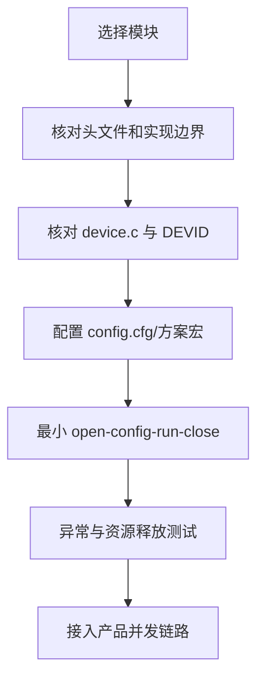

### 17.2 OSAL 与工作队列

**功能。** 为任务、互斥量、信号量、队列、事件、定时器、内存和 workqueue 提供统一抽象。CPU0 在 `sdk/chip/txw82x/system0.c` 初始化内核，应用不得直接依赖某一 RTOS 私有对象。

**位置与配置。** `sdk/include/osal/`；任务和对象上限由工程 OS 配置决定。普通系统节拍为 1ms 量级，实际延迟还受优先级、关中断和负载影响。

**关键 API。** `os_task_create()`、`os_mutex_init()`、`os_sema_init()`、`os_msgq_init()`、`os_timer_init()`、`os_run_work()`、`os_run_work_delay()`、`os_malloc()`、`os_malloc_psram()`。

**Demo/验证。** 参考 `project/txw82xApp/main.c:sys_main_loop()` 的延迟 work；验证周期调度、取消、任务退出、栈余量和内存回收，可用 `os_task_print()`、`os_cpuloading()` 辅助观察。

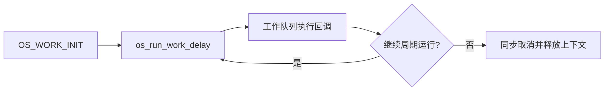

> [!WARNING]
> ISR 中禁止 sleep、动态分配和等待阻塞锁；work 回调中不要死循环。释放业务对象前必须同步取消仍可能访问它的 work/timer，否则会产生悬空访问。

### 17.3 系统事件

**功能。** 在 Wi-Fi、BLE、网络、USB、存储和业务之间传递低频状态，避免模块直接耦合。事件声明位于 `sdk/include/lib/common/sysevt.h`。

**位置与配置。** `project/txw82xApp/events.c` 注册总处理器；启动代码调用 `sys_event_init()`。事件池容量由初始化参数决定，不能承担逐帧视频或逐包音频数据。

**关键 API。** `sys_event_init()`、`sys_event_new()`、`sys_event_take()`、`sys_event_untake()`；具体原型以 `sysevt.h` 为准。

**Demo/验证。** 跟踪 STA 连接、DHCP 成功、SD 热插拔和 BLE 配网事件；回调只更新状态或投递 work，耗时动作转入任务上下文。

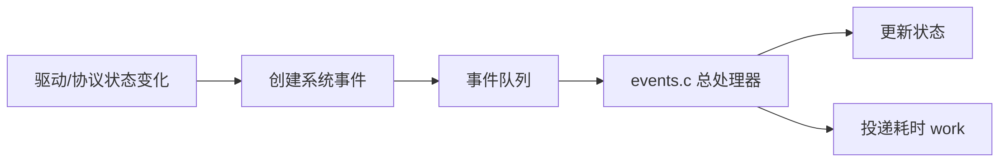

> [!CAUTION]
> 事件回调可能运行在共享上下文。不要在回调内执行长时间网络访问、文件写入或等待其他事件；事件数据的所有权和释放时机必须按 `sysevt.h` 约定处理。

### 17.4 参数管理

**功能。** 管理出厂参数、系统运行参数和用户扩展参数，支持从 Flash 参数区加载、默认值回退、修改和保存。

**位置与配置。** 公共接口在 `sdk/include/lib/syscfg/syscfg.h`；本产品参数结构和默认值在 `project/txw82xApp/syscfg.c`、`project/txw82xApp/syscfg.h`。板级引脚参数由 `pin_param.h + config.cfg` 在固件生成阶段注入，与运行时 syscfg 不是同一层。

**关键 API。** 公共层使用 `syscfg_init()`，产品层提供 `syscfg_default()`、`syscfg_save()`；产品代码通过 `sys_cfgs` 读取 Wi-Fi、码流和业务默认值。

**Demo/验证。** 修改一个非安全测试参数，保存并重启确认；再构造校验失败/空参数区，确认回退到默认值且不会越界读取。

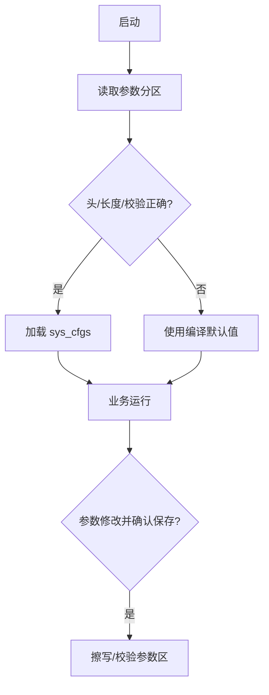

> [!WARNING]
> SSID、密码、密钥、MAC 和校准数据不得打印到普通日志。改变参数结构、长度或校验规则时必须提供版本迁移；禁止把其他 SDK/板卡的参数区镜像直接烧入当前产品。

### 17.5 双核与 RPC

**功能。** CPU0 运行应用、网络上层和多媒体，CPU1 运行 LMAC、BLE LL/HCI 等实时 Core；RPC 负责跨核请求、回调和共享资源协同。

**位置与配置。** 公共接口 `sdk/include/lib/rpc/cpurpc.h`；双核启动在 `sdk/chip/txw82x/system0.c`、`system1.c`，CPU1 应用入口在 `project/txw82xCore/main.c`。

**关键对象/API。** CPU RPC 消息、远端函数注册、同步/异步调用和 ready 握手均以 `cpurpc.h` 及具体模块封装为准；Wi-Fi 设备代理见 `sdk/lib/net/wifi/wifi_dev_rpc.c`。

**Demo/验证。** 完整构建 Core→App 后观察 `CPU1 ready!`；验证 RPC 超时、CPU1 未启动、并发调用和重启后的资源恢复。

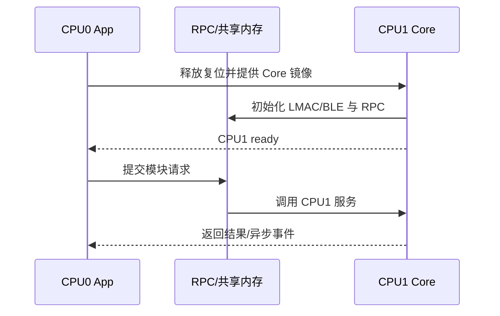

> [!WARNING]
> 跨核指针只有在双方可见且生命周期、Cache 属性一致时才有效。不要把 CPU0 栈地址、已释放 buffer 或未 clean 的 Cache 数据直接交给 CPU1；RPC 超时后也不能立即复用仍可能被远端访问的内存。

### 17.6 内存、DMA 与 Cache

**功能。** SRAM 用于低延迟控制和关键结构，PSRAM 承载大图像、码流及媒体 heap；M2M DMA 和视频硬件在 CPU Cache 之外访问内存。

**位置与配置。** 链接脚本和工程配置决定 CPU0/CPU1 SRAM 边界；媒体池由各产品 Demo 初始化。公共 DMA 接口在 `sdk/include/hal/dma.h`，内存/Cache 平台实现位于 `sdk/chip/txw82x/`。

**关键 API。** `os_malloc()`、`os_malloc_psram()`、`os_free()`、DMA open/config/start/IRQ 接口及平台 Cache clean/invalidate 接口；名称和对齐要求以当前头文件为准。

**Demo/验证。** 对 SRAM↔SRAM、SRAM↔PSRAM 做不同长度、对齐和并发复制；记录端到端时间并校验内容，不只测 DMA 提交时间。

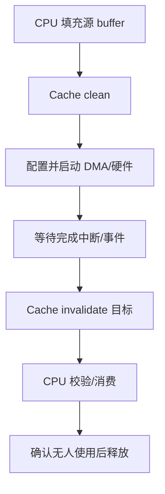

> [!WARNING]
> DMA 读取 CPU 刚写的数据前要 clean；CPU 读取 DMA 刚写的数据前要 invalidate。传输完成前禁止释放、改写或把同一 buffer 交给另一个硬件模块。

### 17.7 GPIO 与引脚复用

**功能。** 提供输入、输出、上下拉、开漏、边沿中断和任意输入/输出映射。HAL 位于 `sdk/include/hal/gpio.h`，芯片映射位于 `sdk/include/chip/txw82x/io_function.h`，实现见 `sdk/driver/gpio/`。

**配置/API。** 先由 `device.c` attach GPIO 设备，再用 `gpio_set_mode()`、`gpio_set_dir()`、`gpio_set_val()`、`gpio_get_val()`、`gpio_request_pin_irq()`；任意映射使用 `gpio_iomap_input()`、`gpio_iomap_output()`。

**Demo/验证。** 选择原理图确认的空闲脚，依次验证输入、输出、上拉/下拉、中断和休眠保持；LED 可参考各产品 Demo 的 `app_io_init()`，但有效电平须按本板修改。

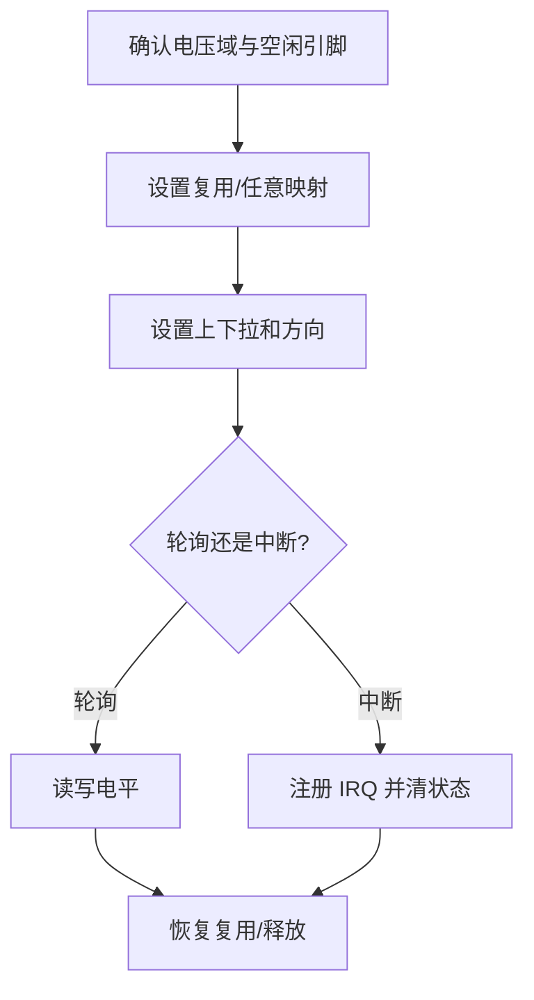

> [!WARNING]
> 不要批量重配全部 GPIO。Flash、调试口、Sensor、SD、LCD、电源使能和 PA MUTE 可能共享引脚；错误电平会导致系统掉电、总线冲突或外设损坏。

### 17.8 UART

**功能。** 用于 CPU0/CPU1 日志、AT 命令和产品通信。接口在 `sdk/include/hal/uart.h`，实现见 `sdk/driver/uart/`。

**配置/API。** `device.c` 注册实例，引脚来自 `config.cfg`；常用 `uart_open()`、`uart_puts()`、`uart_gets()`、`uart_ioctl()`、`uart_request_irq()`、`uart_close()`。

**Demo/验证。** 在非 console UART 上做 TX-RX 物理回环，覆盖不同波特率、长包、FIFO 溢出、校验错误和睡眠恢复；学习板 J14 为 PD13/PD12。


> [!CAUTION]
> console、AT 和产品数据共用 UART 会造成日志与协议帧交织。修改 UART0 或调试引脚前先保留替代日志通道，否则故障时可能完全失去可观测性。

### 17.9 I2C

**功能。** 用于 Sensor、触摸、电源管理和板级外设。HAL 位于 `sdk/include/hal/i2c.h`，驱动见 `sdk/driver/i2c/`，FPV Sensor 的串行化访问见 `sdk/app/app_iic/`。

**配置/API。** `i2c_open()`、`i2c_set_baudrate()`、`i2c_read()`、`i2c_write()`、`i2c_write_scatter()`、`i2c_ioctl()`、`i2c_close()`。

**Demo/验证。** 用已知地址的 Sensor/EEPROM 先读 ID，再做寄存器写回；覆盖 NACK、错误地址、SCL/SDA 拉低、重复 START、超时恢复和多任务互斥。

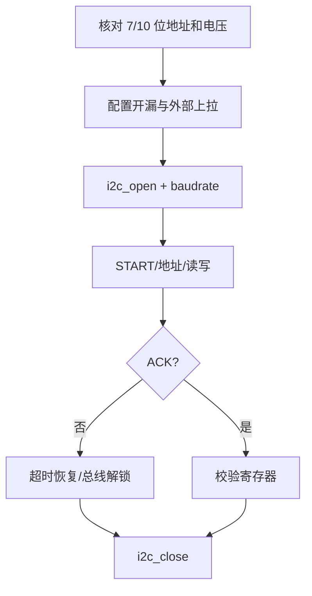

> [!WARNING]
> I2C 引脚必须工作在正确 IO 电压域并使用合适外部上拉。同一 Sensor 总线应经过现有串行化层，禁止多个任务绕过互斥并发改写 Sensor 寄存器。

### 17.10 SPI

**功能。** 支持主/从串行传输、不同 wire/clock mode、片选控制和 scatter，接口位于 `sdk/include/hal/spi.h`，实现见 `sdk/driver/spi/`。

**配置/API。** `spi_open()` 显式指定时钟、主从、线宽和 CPOL/CPHA；使用 `spi_read()`、`spi_write()`、`spi_write_scatter()`、`spi_set_cs()`、`spi_ioctl()`、`spi_close()`。

**Demo/验证。** 在独立测试从设备上覆盖四种模式、不同速率、长短事务、CS 极性、半双工切换和 DMA/IRQ；先读 JEDEC ID，再在安全地址做擦写校验。

```mermaid
flowchart TD
    A[确认从设备规格] --> B[配置 SCLK/MOSI/MISO/CS]
    B --> C[spi_open 模式与频率]
    C --> D[命令+地址+数据]
    D --> E[等待 busy/IRQ]
    E --> F[读回校验]
    F --> G[释放 CS 并 close]
```

> [!WARNING]
> 擦写 SPI NOR 前必须确认目标不是系统启动 Flash，且地址不属于固件、参数、校准或 OTA 分区。禁止把“地址 0 测试”直接用于正常学习板。

### 17.11 Flash 与 PSRAM

**功能。** Flash 保存启动镜像、参数、文件和升级区；PSRAM 承载大块 heap、视频帧、码流和音频 RPC。SPI NOR HAL 在 `sdk/include/hal/spi_nor.h`，PSRAM heap 在 `sdk/lib/heap/`。

**配置/API。** `spi_nor_read()`、`spi_nor_write()`、`spi_nor_sector_erase()`；动态内存使用 `os_malloc_psram()` 或各媒体专用 heap。器件容量、线宽、DTR、电压和时钟由板级/启动配置共同决定。

**Demo/验证。** Flash 只在已确认的测试分区做擦写读回；PSRAM 做地址线、非对齐、Cache、DMA、全容量和温度压力测试，同时监控媒体 heap 水位。

```mermaid
flowchart TD
    A[识别器件 ID/容量/电压] --> B{Flash 还是 PSRAM?}
    B -- Flash --> C[核对分区边界]
    C --> D[擦除-写入-读回-校验]
    B -- PSRAM --> E[初始化映射和 heap]
    E --> F[分配-Cache/DMA-释放]
    D --> G[错误恢复与寿命统计]
    F --> G
```

> [!WARNING]
> Flash 擦除不可恢复；执行前必须解析当前镜像分区并保留可恢复固件。PSRAM 容量和地址范围不能只按芯片系列推断，必须以当前料号、启动日志和链接配置为准。

### 17.12 Timer、PWM 与 Capture

**功能。** Timer 提供定时/计数，PWM 输出周期波形，Capture 测量外部边沿、周期和脉宽。公共头文件为 `timer_device.h`、`pwm.h`、`capture.h`，开放实现位于对应 `sdk/driver/`。

**配置/API。** `timer_device_open/start/stop()`；`pwm_init/start/stop/deinit()`；`capture_init/start/stop/deinit()` 及各自 IRQ/ioctl 接口。

**Demo/验证。** 把一个空闲 PWM 输出接到 Capture 输入，改变频率和占空比并比较测量值；覆盖计数溢出、停止、重启、休眠和时钟切换。

```mermaid
flowchart TD
    A[选择时钟和通道] --> B[PWM 配置周期/高电平]
    B --> C[启动 PWM]
    C --> D[Capture 捕获边沿]
    D --> E[计算频率/占空比]
    E --> F[与期望值比较]
    F --> G[stop/deinit]
```

> [!CAUTION]
> 周期参数通常是时钟计数值而非 Hz。系统主频、分频或低功耗时钟变化后必须重新计算；共享 Timer/PWM 通道前先确认没有被系统滴答、红外、背光或呼吸灯占用。

### 17.13 ADC、RTC 与 Watchdog

**功能。** ADC 用于 ADKEY、电压和模拟量采样；RTC 提供时间和唤醒；Watchdog 处理失控恢复。ADC/RTC 公共头文件在 `sdk/include/hal/adc.h`、`rtc.h`，WDT 设备定义在 `sdk/include/dev/wdt/`。

**配置/API。** ADC：`adc_open()`、`adc_add_channel()`、`adc_get_value()`、`adc_get_vref()`；RTC：`rtc_open()`、`rtc_set_time()`、`rtc_get_time()`、IRQ；WDT 使用当前设备 ops 配置超时、喂狗和复位。

**Demo/验证。** ADC 用已知电压和 1% 分压电阻校准；RTC 做跨日、掉电/睡眠和唤醒；WDT 使用专用测试固件故意停止喂狗并确认复位原因。

```mermaid
flowchart TD
    A[初始化 ADC/RTC/WDT] --> B[ADC 周期采样并滤波]
    A --> C[RTC 计时/设置闹钟]
    A --> D[关键任务健康检查]
    D --> E{全部健康?}
    E -- 是 --> F[喂狗]
    E -- 否 --> G[保留错误上下文并等待复位]
    C --> H[RTC 唤醒]
```

> [!WARNING]
> 看门狗验证会主动复位设备，只能用可恢复测试固件。不要在任务中无条件喂狗；应由健康监控确认关键任务、存储和双核状态后统一喂狗。

<a id="module-adkey-input"></a>

### 17.14 ADKEY 与输入设备

**功能。** ADKEY/触摸屏提供输入。触摸屏组件在 `sdk/lib/touch/`。

**配置/API。** 触摸屏需配置 I2C、RST、INT、坐标方向和屏幕尺寸。学习板 TP 使用 PC8/PC10/PC11/PC12。

**Demo/验证。** 触摸 UI 可参考 `sdk/app/ui/touch_pad_test_ui.c`；验证单击、长按、多点（若支持）、边缘坐标、旋转、去抖和睡眠唤醒。

```mermaid
%%{init: {"themeVariables": {"fontSize": "18px"}, "flowchart": {"useMaxWidth": false}}}%%
flowchart LR
    A[GPIO/ADC/I2C 原始输入] --> B[中断或周期采样]
    B --> C[去抖/滤波/坐标变换]
    C --> D[输入事件]
    D --> E[业务/LVGL]
```

> [!CAUTION]
> 学习板 DVP 与触摸存在硬件复用限制；启用触摸前核对接口批次和 `config.cfg`。输入回调中不要直接执行耗时 UI 绘制或 Flash 保存。

### 17.15 SD Host 与 SDIO

**功能。** SD Host 用于 TF/SD/eMMC，SDIO Slave/外接无线模块用于设备或主控交互。协议实现见 `sdk/lib/sdhost/`，SDIO 公共接口见 `sdk/include/hal/sdio_slave.h`。

**配置/API。** 学习板 SD 引脚为 PA6/PA7/PA8/PA11/PA12/PA13，对应的 `PIN_SDH_CLK`、`PIN_SDH_CMD` 和 `PIN_SDH_DAT0`～`PIN_SDH_DAT3` 等 IO 参数由 `config.cfg` 提供；SD 引脚不需要在业务代码中修改。卡检测、电源、时钟、总线宽度和挂载流程均由下述代码控制。

| 配置项 | 当前代码入口与行为 |
| --- | --- |
| 控制器实例 | `project/txw82xApp/device.c` 定义 `sdh`（`SDHOST_BASE`、`SDHOST_IRQn`），并通过 `hgsdh_attach(HG_SDIOHOST_DEVID, &sdh)` 注册 |
|  |
| 文件系统入口 | `app_sd_init()` 依次调用 `vfs_fatfs_register()` 和 `fatfs_sd0_init()`；业务通常从 `/sd0/` 访问 |
| SD Host 参数 | `sdk/lib/fs/fatfs/fatfs_test.c:fatfs_sd0_init()` 调用 `sdhost_init(48 * 1000 * 1000, 0)`，传入 48MHz 目标时钟和默认初始化标志（推荐SDHC_INIT_FLAGS_SINGLE_BLK_RW_EN） |
| 总线宽度 | `sdk/lib/sdhost/sdhost.c:sd_init()` 当前以 `bw = 1` 打开控制器；只有 Host 标志允许 4-bit 且卡的 SCR 声明支持时，驱动才发送 `SD_APP_SET_BUS_WIDTH` 并切换 4-bit |
| 插拔检测 | `sdh_loop()` 每 500ms 尝试初始化或发送卡状态命令，根据结果调用 `dev_hotplug_in()`/`dev_hotplug_out()`；当前路径不是从 `config.cfg` 读取独立 CD 引脚 |

上层通常通过 `app_sd_init()` 和文件系统访问，不建议业务直接操作块设备。

**Demo/验证。** 参考 `sdk/demo/app_common.c:app_sd_init()`，覆盖插卡、拔卡、不同容量/速度等级、连续写、掉电和重新挂载；SDIO 另测枚举、块大小、中断和流控。

```mermaid
flowchart TD
    A["SD 上电"] --> B["app_sd_init"]
    B --> C["vfs_fatfs_register"]
    C --> D["fatfs_sd0_init"]
    D --> E["sdhost_init"]
    E --> F["sd_init 识别卡并协商总线"]
    F --> G{"初始化成功?"}
    G -- 是 --> H["dev_hotplug_in + 挂载 /sd0"]
    G -- 否 --> I["sdh_loop 默认 500ms 后重试"]
    H --> J["文件读写/录卡"]
    J --> K["状态轮询/拔卡事件/安全卸载"]
```

> [!WARNING]
> 正在写卡时拔卡或断电会破坏文件和文件系统。产品必须检查短写、同步元数据并采用分段/恢复策略；卡电源和 IO 电压改变前先停止总线。

> [!CAUTION]
> 配置了 DAT1～DAT3 不等于软件已经工作在 4-bit 模式，也不能把传给 `sdhost_init()` 的 48MHz 直接视为卡端最终稳定时钟。必须结合初始化日志、Host 标志、卡能力和示波器实测确认实际总线宽度与时钟。

### 17.16 文件系统

**功能。** VFS 为 FatFs 等后端提供统一 POSIX 风格接口。实现位于 `sdk/lib/fs/vfs/`、`sdk/lib/fs/fatfs/`，挂载和热插拔逻辑见 `project/txw82xApp/mount.c`。

**配置/API。** `vfs_fatfs_register()`、`fatfs_sd0_init()` 及 `fopen/fread/fwrite/fclose` 或 POSIX 文件接口；路径通常以 `/sd0/` 开头。

**Demo/验证。** `sdk/lib/fs/fatfs/fatfs_test.c` 可作功能参考；产品优先通过 `app_sd_init()` 建立完整设备和挂载流程，测试满盘、长文件名、重复挂载、坏簇和异常掉电。

```mermaid
flowchart TD
    A[块设备 ready] --> B[注册 VFS/FatFs]
    B --> C[挂载 /sd0]
    C --> D[open/read/write]
    D --> E[flush/close]
    E --> F[卸载]
    F --> G[移除介质/断电]
```

> [!CAUTION]
> 业务必须以挂载事件为准，不能仅凭“检测到卡”就访问路径。文件句柄、目录和录像索引应在卸载前关闭；格式化只允许对用户明确选择且可恢复的介质执行。

### 17.17 USB

**功能。** 当前 SDK 提供 USB1.1/USB2.0 Host/Device 框架及 UVC、UAC、HID、CDC、Mass Storage、RNDIS 等类，代码位于 `sdk/lib/bus/rttusb/`，设备 HAL 在 `sdk/include/hal/usb_device.h`。

**配置/API。** `project/txw82xApp/device.c` attach 控制器，产品入口参考 `sdk/demo/app_common.c:app_usb_init()`；Host/Device 角色、速度、VBUS、检测脚和类驱动必须成套配置。Cat.1 接入需启用 USB Host 无线/RNDIS 类，具体操作参阅 [Cat.1 模组接入指南][web-cat1]。

**Demo/验证。** 分别验证枚举、插拔、端点传输、异常设备、过流和睡眠恢复；UVC/UAC 还需验证协商格式、带宽和持续流。Cat.1 需额外验证模组识别、`l0`、DHCP、DNS、弱网、运营商掉线、反复插拔以及 Wi-Fi/Cat.1 路由切换。

```mermaid
flowchart TD
    A[检测 VBUS/设备] --> B{Host 还是 Device?}
    B -- Host --> C[复位/枚举/匹配类驱动]
    B -- Device --> D[注册描述符和端点]
    C --> E[类数据传输]
    D --> E
    E --> F[拔出/停止]
    F --> G[取消 URB/端点并释放]
```

> [!WARNING]
> Host VBUS 供电方向、限流和过流保护必须由硬件确认。禁止两端同时驱动 VBUS；USB 角色切换或拔出时先取消所有异步传输，不能释放仍由控制器持有的 buffer。

### 17.18 Ethernet

**功能。** TXW828 可通过 RMII MAC 外接 PHY，并接入 lwIP。公共网络设备接口在 `sdk/include/hal/netdev.h`，lwIP 以太网适配位于 `sdk/lib/net/lwip/src/netif/`；具体 GMAC/PHY attach 由产品配置控制。

**配置/API。** 配置 RMII 引脚、50MHz 时钟方向、PHY 地址、复位、MDIO/MDC 和网卡名；上层通过 netif、DHCP 和 Socket 使用。

**Demo/验证。** 先读 PHY ID 和 Link 状态，再验证 DHCP、静态 IP、ping、TCP/UDP、断线重连和 Wi-Fi/以太网默认路由切换。

```mermaid
flowchart TD
    A[PHY 供电/复位] --> B[MDIO 读取 ID]
    B --> C[协商 Link/速率/双工]
    C --> D[注册 lwIP netif]
    D --> E[DHCP 或静态 IP]
    E --> F[Socket 业务]
    F --> G[Link down 清理/重连]
```

> [!CAUTION]
> 当前默认 720P IPC 不等于默认启用 Ethernet。没有匹配 RMII PHY、时钟和引脚配置时不要仅打开软件宏；多网卡产品必须明确默认路由和 DNS 切换策略。

### 17.19 CRC、AES 与 SHA

**功能。** CRC 用于数据校验，AES/SHA 用于加解密和摘要。公共头文件为 `sdk/include/hal/crc.h`、`sysaes.h`、`sha.h`，开放实现见 `sdk/driver/crc/`、`sysaes/`、`sha/`。

**配置/API。** 先 attach/获取对应设备，再配置算法、模式、Key/IV 和 buffer；API 以各 HAL 头文件为准。数据长度、对齐和 DMA 可见性需满足硬件约束。

**Demo/验证。** 使用公开标准向量验证 CRC、多种 AES Key 长度/模式和 SHA1/SHA256，覆盖空输入、非对齐、分块、并发和错误长度。

```mermaid
%%{init: {"themeVariables": {"fontSize": "18px"}, "flowchart": {"useMaxWidth": false}}}%%
flowchart LR
    A["选择算法与<br/>标准向量"] --> B["配置模式<br/>Key / IV"]
    B --> C["准备对齐 buffer<br/>执行 Cache 维护"]
    C --> D[硬件计算]
    D --> E[与标准结果常量时比较]
    E --> F[清零密钥和临时 buffer]
```

> [!WARNING]
> CRC 不是安全认证。AES 模式、随机数、Nonce/IV、密钥存储和签名校验必须由安全方案整体设计；禁止硬编码量产密钥、复用 CTR/GCM Nonce 或在日志中输出密钥材料。

### 17.20 Wi-Fi

**功能。** 提供 2.4GHz 802.11 b/g/n AP、STA 及工程中启用的扩展模式。CPU1 承担 LMAC，CPU0 负责配置、事件、lwIP 和业务。

**位置与配置。** CPU0 入口 `project/txw82xApp/wifi.c`，协议接口 `sdk/include/lib/umac/ieee80211.h`，设备代理 `sdk/lib/net/wifi/wifi_dev_rpc.c`；SSID、信道、加密、功率、聚合和省电来自工程宏与 `sys_cfgs`。接口和典型流程参阅 [TXSDK Wi‑Fi 开发指南][web-wifi]。

**关键 API。** `ieee80211_iface_create_ap/sta()`、`ieee80211_iface_start()`、`ieee80211_conf_set_*()`、`ieee80211_scan()`、`ieee80211_start_connect()`、`ieee80211_event_cb()` 等以当前头文件为准。

**Demo/验证。** 默认产品走 `sys_wifi_init()`；分别验证 AP/STA、错误密码、漫游/重连、不同信道和带宽、弱信号、长时吞吐及 BLE 共存。

```mermaid
flowchart TD
    A[CPU1 ready] --> B[Wi-Fi 参数初始化]
    B --> C[创建 AP/STA 接口]
    C --> D[配置 MAC/信道/SSID/安全]
    D --> E[启动接口]
    E --> F{AP 还是 STA?}
    F -- AP --> G[Beacon + DHCP Server]
    F -- STA --> H[扫描/认证/关联 + DHCP Client]
    G --> I[网络业务]
    H --> I
```

> [!WARNING]
> 国家/地区信道、发射功率和射频校准必须使用经过审核的配置。不得通过修改软件上限绕过法规或硬件限制；PSK/密码不得打印。

### 17.21 BLE

**功能。** CPU1 初始化 BLE Link Layer/HCI Controller，CPU0 运行 UBLE Host、GATT 和配网应用。代码位于 `sdk/lib/bluetooth/`，产品配网接入见 `project/txw82xApp/ble.c`。

**配置/API。** `SYS_APP_BLENC` 选择连接式或广播式配网；常用 `ble_demo_init()`、`uble_init()`、`uble_gatt_notify()`/`indicate()`，ATT Table、UUID 和权限以当前 UBLE 示例为准。BLE 基础开发参阅 [TXSDK BLE 开发指南][web-ble]，配网参阅 [TXW8xx SDK BLE 配网开发指南][web-ble-provisioning]。

**Demo/验证。** 以当前代码中的广播、可扫描广播和连接配网实现为准，测试发现、连接、MTU、读写权限、异常长度、超时和 Wi-Fi 共存。

```mermaid
sequenceDiagram
    participant C as CPU1 Controller
    participant H as CPU0 UBLE Host
    participant P as 手机/配网端
    C->>H: HCI ready
    H->>P: 广播服务/配网标识
    P->>H: 连接并写入凭据
    H->>H: 校验长度/会话/权限
    H-->>P: GATT 响应
    H->>H: 发布已配网事件并启动 STA
```

> [!WARNING]
> BLE 配网数据属于敏感凭据。产品应增加会话认证、重放保护、长度检查和超时清理；不要把示例明文协议直接作为量产安全方案。

### 17.22 lwIP 与 Socket

**功能。** 提供 IPv4/IPv6、DHCP、DNS、TCP/UDP 和 BSD Socket；代码位于 `sdk/lib/net/lwip/`，产品初始化见 `project/txw82xApp/network.c`。

**配置/API。** `tcpip_init()` 后注册网卡并选择 DHCP/静态 IP；应用使用 `socket()`、`connect()`、`send()`、`recv()`、`select()`、`closesocket()`。TCP 窗口、PBUF、PCB 和内存池在 lwIP 配置中统一权衡，协议与应用范式参阅 [TXSDK 网络应用开发指南][web-network]。

**Demo/验证。** 使用已知服务器做 TCP/UDP 回环，覆盖 DNS、超时、半关闭、服务器断开、Wi-Fi 重连、多网卡和网络拥塞；记录 `errno`、netif 地址和内存水位。

```mermaid
flowchart TD
    A[Wi-Fi/Ethernet Link up] --> B[netif up]
    B --> C[DHCP/静态地址]
    C --> D[DNS/路由就绪]
    D --> E[socket-connect/bind]
    E --> F[send/recv/select]
    F --> G[断线/超时处理]
    G --> H[shutdown/close]
```

> [!CAUTION]
> Socket 返回成功不代表数据已被对端持久接收。业务必须处理短发送、`EAGAIN`、超时、断线和重连；网络事件回调中不要阻塞等待 Socket。

### 17.23 Sensor、MIPI CSI 与 DVP

**功能。** Sensor 产生 RAW/YUV 数据，MIPI CSI/DVP 接收并交给 ISP 或后续视频桥。接口位于 `sdk/include/hal/csi2.h`、`dvp.h`，MIPI 组件在 `sdk/lib/video/mipi_csi/`，Sensor 驱动在 `sdk/lib/video/dvp/cmos_sensor/`。

**配置/API。** 方案宏选择 Sensor、分辨率、帧率、lane、数据类型和 MCLK；`config.cfg` 提供 I2C、PWDN、RESET、电源和 MIPI 管脚。默认 720P IPC 使用 GC1084，实际以工程宏和启动日志为准。

**Demo/验证。** 先读 Sensor ID，再按“电源→MCLK→I2C 表→CSI/DVP→出帧”逐级验证；MIPI 调参参考 `sdk/demo/isp_tuning_demo/` 和最接近产品 Demo。

```mermaid
%%{init: {"themeVariables": {"fontSize": "18px"}, "flowchart": {"useMaxWidth": false}}}%%
flowchart LR
    A["Sensor 电源<br/>和电压域"] --> B["MCLK 与<br/>RESET/PWDN 时序"]
    B --> C["I2C 读 ID<br/>写寄存器表"]
    C --> D["配置 CSI lane<br/>或 DVP 时序"]
    D --> E[等待 VSYNC/帧中断]
    E --> F[检查 RAW/YUV 尺寸和错误计数]
```

> [!WARNING]
> Sensor 的 AVDD、DVDD、IOVDD、MIPI/DVP 电平和跳线必须完全匹配。禁止在未知电压下反复扫描 I2C 或热插拔镜头；错误供电可能造成永久损坏。

### 17.24 ISP

**功能。** 对 RAW 图像执行坏点、黑电平、降噪、白平衡、曝光、色彩、Gamma 等处理。代码位于 `sdk/lib/video/isp/`，HAL/调参接口见 `sdk/include/hal/isp.h`、`isp_param.h`、`isp_tunning.h`。

**配置/API。** ISP 参数必须与 Sensor 型号、镜头、分辨率、帧率和场景匹配；初始化由产品 Demo 的 `app_isp_init()`/视频链路封装完成，调参工具入口在 `sdk/demo/isp_tuning_demo/`。

**Demo/验证。** 固定曝光/增益先确认 RAW 与出帧，再逐项启用 3A 和图像模块；保存测试光源、色温、照度、曝光、增益、帧率和参数版本。

```mermaid
%%{init: {"themeVariables": {"fontSize": "18px"}, "flowchart": {"useMaxWidth": false}}}%%
flowchart LR
    A[RAW 帧] --> B[黑电平/坏点/LSC]
    B --> C[2D/3D 降噪]
    C --> D[AE/AWB/AF 统计与控制]
    D --> E[CCM/Gamma/锐度/饱和度]
    E --> F[YUV 输出到 VPP]
```

> [!CAUTION]
> 其他 Sensor/镜头的 ISP 参数不能直接复制为量产参数。图像主观改善可能增加噪声、拖影或码率，必须与 H.264、低照度和温升一起评估。

### 17.25 VPP

**功能。** VPP 连接 ISP 和下游帧缓冲，提供多路输出、水印、运动检测、裁剪/缩放相关控制。HAL 位于 `sdk/include/hal/vpp.h`，实现和上层封装位于 `sdk/driver/vpp/`、`sdk/lib/video/vpp/`。

**配置/API。** `vpp_open()`、`vpp_set_video_size()`、输入接口、BUF0/BUF1 地址/计数、水印、motion、IRQ、`vpp_suspend()/resume()`；产品优先使用现有视频初始化封装。

**Demo/验证。** 默认 720P IPC 检查 `VPP_DATA0`/副流 producer、帧号、尺寸、stride、buffer 水位和丢帧；逐个启用水印、运动检测和第二输出。

```mermaid
flowchart TD
    A[ISP YUV] --> B[VPP 输入/尺寸配置]
    B --> C[BUF0 主输出]
    B --> D[BUF1/缩小输出]
    B --> E[水印/运动统计]
    C --> F[H.264/JPEG/MSI]
    D --> F
    E --> G[业务事件]
```

> [!WARNING]
> VPP buffer 的尺寸、格式、stride 和物理地址必须一致。修改 buffer 数量或 PSRAM/SRAM 布局后要重新计算总容量，禁止让两个消费者无所有权协议地改写同一帧。

### 17.26 Dual、Gen、PRC 与视频桥接

**功能。** Dual/GEN420/GEN422/PRC/PARA_IN 等硬件块在输入、格式、缩放、编码、显示和回灌之间桥接视频数据。公共 HAL 位于 `dual_org.h`、`gen420.h`、`gen422.h`、`prc.h`、`para_in.h`。

**配置/API。** 设备实例由 `device.c` attach；业务通过 `sdk/lib/video/dual/`、`sdk/lib/video/gen/` 以及 `sdk/app/video_app/` 的 MSI 封装使用。源、目标、格式、宽高、stride 和 buffer 队列必须成套配置。

**Demo/验证。** 副码流参考 `gen420_hardware_msi_init()`，回灌/双目选择最接近的 Demo；验证空队列、满队列、超时、格式错配和停止重启。

```mermaid
flowchart TD
    A[CSI/DVP/解码回灌] --> B{视频桥选择}
    B --> C[Dual 双目组织]
    B --> D[GEN420/422 格式生成]
    B --> E[PRC/PARA_IN 数据处理]
    C --> F[统一 buffer 队列]
    D --> F
    E --> F
    F --> G[编码/显示/算法]
```

> [!CAUTION]
> 这些模块共享视频总线和 buffer。发生队列满时应按产品策略丢帧或降级，不能在硬件回调里无限等待下游；停流必须先停 producer，再排空消费者。

### 17.27 Scale、Rotate、CSC 与 DMA2D

**功能。** 提供图像缩放、旋转、镜像、颜色空间转换、混合和 2D 搬运。HAL 位于 `scale.h`、`rotate.h`、`csc.h`、`dma2d.h`；开放实现包括 `sdk/driver/scale/`、`sdk/hal/rotate.c`、`sdk/hal/dma2d.c`。

**配置/API。** Scale 使用硬件互斥与 MSI 封装；DMA2D 常用 `dma2d_memcpy()`、`dma2d_convert()`、`dma2d_mixture()`。所有操作都必须给出正确格式、宽高、stride 和地址。

**Demo/验证。** LCD/LVGL 工程验证 DMA2D 和旋转，副码流验证 Scale；覆盖奇数尺寸、边界 stride、重叠 buffer、Alpha、PSRAM、Cache 和多模块并发。

```mermaid
flowchart TD
    A[输入 buffer/格式/stride] --> B[申请硬件互斥]
    B --> C[配置 Scale/Rotate/CSC/DMA2D]
    C --> D[Cache clean + 启动]
    D --> E[等待完成]
    E --> F[invalidate + 校验输出]
    F --> G[释放互斥/buffer]
```

> [!WARNING]
> 不能仅按 `宽×高×像素字节数` 猜测图像大小；必须考虑 Y/UV 平面、stride、对齐和格式。输入输出重叠是否支持需以具体 API 为准。

### 17.28 H.264

**功能。** 硬件 H.264 编解码用于实时视频。HAL 位于 `sdk/include/hal/h264.h`，上层封装在 `sdk/lib/video/h264/`、`sdk/app/video_app/`，当前工程的具体实现部分来自预编译库。

**配置/API。** 产品优先通过 `app_h264_init()`/`auto_h264_msi_init()` 建立编码组件；配置分辨率、帧率、GOP、码率/QP、输入源、3DNR 和超时。芯片规格上限不等于当前并发方案保证值。

**Demo/验证。** 默认 720P IPC 主流 1280×720、副流 640×360；验证 I/P 帧、SPS/PPS、GOP、码率峰值、场景突变、弱网和录卡并发。

```mermaid
flowchart TD
    A[VPP_DATA0/GEN420_DATA] --> B[AUTO_H264 MSI]
    B --> C[配置 GOP/码率/QP]
    C --> D[硬件编码]
    D --> E[SPS/PPS + I/P 帧]
    E --> F[RTSP]
    E --> G[MP4/AVI 录卡]
```

> [!CAUTION]
> I 帧峰值可能远高于平均帧长。码流 buffer、网络队列和录卡缓存必须按峰值设计；同一编码实例不能被两个上层直接并发控制。

### 17.29 JPEG

**功能。** JPEG 编解码用于拍照、MJPEG、缩略图和回放。HAL 位于 `sdk/include/hal/jpeg.h`，上层在 `sdk/lib/video/dvp/jpeg/`、`sdk/lib/multimedia/image/coder/`。

**配置/API。** `jpg_open()`、`jpg_init()`、`jpg_set_size()`、`jpg_set_addr()`、`jpg_set_qt()`、`jpg_decode_photo()`；产品拍照流可用 `jpg_mutex_init()`、`jpg_mem_init()`、`auto_jpg_msi_init()`。

**Demo/验证。** 从 `VPP_DATA0` 建立 `AUTO_JPG`，覆盖不同质量、复杂场景、最大输出长度、截断输入、超时、连续拍照和双实例并发。

```mermaid
%%{init: {"themeVariables": {"fontSize": "18px"}, "flowchart": {"useMaxWidth": false}}}%%
flowchart LR
    A["VPP/文件<br/>JPEG 输入"] --> B["配置尺寸/量化表<br/>和 buffer"]
    B --> C[JPEG 编码或解码]
    C --> D{完成且长度有效?}
    D -- 是 --> E[文件/网络/显示]
    D -- 否 --> F[停止硬件并回收本帧]
```

> [!WARNING]
> JPEG 输出长度随画面复杂度和质量变化，目标 buffer 必须覆盖最坏情况。解码外部 JPEG 前检查文件长度、尺寸和 marker，防止越界和内存耗尽。

### 17.30 Audio、I2S 与 PDM

**功能。** 模拟 Audio ADC/DAC、Mixer、处理、I2S/PCM、PDM 及 AAC/G.711/AMR/MP3/Opus 等编解码接入。驱动位于 `sdk/driver/i2s/`、`pdm/`，应用位于 `sdk/app/audio_msi/`、`audio_record/`。

**配置/API。** 默认 IPC 使用 `app_audio_init(8000, 16000)`；I2S/PDM 接口在 `sdk/include/hal/i2s.h`、`pdm.h`，常用 `i2s_open/read/write/ioctl()`、`pdm_open/read/ioctl()`。模拟音频专题资料的在线版本从 [TXW82x 官方文档列表][web-doc-list] 查询。

**Demo/验证。** 先分别做 MIC 录音和喇叭播放，再做环回/对讲；覆盖采样率、位宽、通道、增益、DMA 水位、静音底噪、PA MUTE 和长时音视频同步。

```mermaid
flowchart TD
    A[MIC/Audio ADC/I2S/PDM] --> B[DMA 环形缓冲]
    B --> C[重采样/AEC/ANS/AGC/VAD]
    C --> D[PCM/音频编码 MSI]
    D --> E[网络/文件]
    E --> F[解码/Mixer]
    F --> G[Audio DAC/I2S/喇叭]
```

> [!WARNING]
> PA 上电、MUTE、音量和 DAC 数据的顺序错误会产生爆音，严重时损坏喇叭。调试先用低增益和限流电源，禁止把 VCMAU 当外部电源。

### 17.31 LCD、MIPI DSI 与 LVGL

**功能。** LCDC/DSI 输出本地图像，LVGL 提供 UI。代码位于 `sdk/lib/lcd/`、`sdk/lib/lvgl/`、`sdk/app/app_lcd/`，HAL 为 `sdk/include/hal/lcdc.h`、`dsi.h`。

**配置/API。** 面板时序、像素格式、分辨率、lane、DSI 命令、背光和复位必须与屏规格一致；示例入口为 `sdk/demo/lcd_720P_demo/`。DMA2D/Rotate 可用于 LVGL 加速；[TXMPlayer框架说明][web-sdk-framework] 见官网对应章节，屏显异常的专项检查参阅 [TXW82x LCD FAQ][web-lcd-faq]。

**Demo/验证。** 先保持背光关闭验证复位和面板命令，再输出纯色/色条，最后启用 LVGL、触摸和视频层；检查 TE、帧率、撕裂和方向。

```mermaid
flowchart TD
    A[屏电源/复位] --> B[发送 DSI/SPI 初始化命令]
    B --> C[配置 LCDC 时序/格式]
    C --> D[提交 framebuffer]
    D --> E[DSI/RGB/MCU/SPI 输出]
    E --> F[画面稳定后打开背光]
    F --> G[LVGL/触摸/视频层]
```

> [!WARNING]
> 面板 IO 电压、背光升压和 DSI lane 配置错误可能损坏屏或主控。不要用“背光亮”判断 LCD 初始化成功；修改方向时同步处理 stride、触摸坐标和 Cache。

### 17.32 MSI 媒体流框架

**功能。** MSI 把摄像头、VPP、编码、音频、显示、网络和录卡组织为 producer/consumer 图，统一数据交付、热插拔和停止流程。公共接口位于 `sdk/include/lib/multimedia/msi.h`，实现位于 `sdk/lib/multimedia/msi/`。

**配置/API。** 常用 `msi_core_init()`、组件创建/注册、link、data deliver/release、hotplug 和 `msi_dump()`；具体函数以 `msi.h` 及现有组件为准。

**Demo/验证。** 默认 720P IPC 是最完整入口；启动后调用 `msi_dump()` 核对 producer、consumer 和连接，模拟下游阻塞、热插拔、停流与重启。

```mermaid
flowchart TD
    A[Producer 产生 frame] --> B[MSI 引用/所有权]
    B --> C{一个或多个 Consumer}
    C --> D[H.264/JPEG]
    C --> E[LCD/算法]
    C --> F[网络/录卡]
    D --> G[release]
    E --> G
    F --> G
    G --> H[引用归零后回收]
```

> [!WARNING]
> 每个 MSI buffer 必须严格遵守引用和 release 规则。漏 release 会耗尽池，重复 release 或 producer 提前复用会导致花屏、崩溃和随机码流损坏。

### 17.33 RTSP 与网络流媒体

**功能。** RTSP 服务发布 H.264/音频流并处理客户端会话，代码主要位于 `sdk/app/spook/`；其上游来自 MSI 编码器，下游依赖 lwIP Socket。

**配置/API。** 配置端口、媒体描述、payload、时间戳、认证和会话数；产品通过现有 RTSP/spook 初始化入口接入，不建议绕过队列直接发送编码器 buffer。

**Demo/验证。** 用 VLC/ffplay 验证单/多客户端、I 帧加入、音视频时间戳、弱网、客户端异常断开和长时重连。

```mermaid
sequenceDiagram
    participant P as 播放端
    participant R as RTSP/Spook
    participant M as MSI 编码器
    P->>R: OPTIONS/DESCRIBE/SETUP
    R-->>P: SDP 与会话参数
    P->>R: PLAY
    M->>R: H.264/Audio 帧
    R-->>P: RTP/RTCP
    P->>R: TEARDOWN/断开
    R->>R: 释放会话和码流引用
```

> [!CAUTION]
> 网络阻塞不能反压到 Sensor/编码硬件。每个客户端设置独立队列上限和丢帧策略，优先从下一个关键帧恢复；断开时释放全部 buffer 引用。

### 17.34 MP4/AVI 录卡

**功能。** 将 H.264/JPEG 和音频写入 MP4/AVI，代码位于 `sdk/app/video_record/`、`sdk/app/viidure/`、`sdk/app/playback/`。

**配置/API。** 录像配置包含容器、码流、音频、分段时长、文件名、预录/循环和缓存；上层通过现有 recorder/Viidure 组件接入 MSI。

**Demo/验证。** 默认 IPC 录卡链路验证正常停止、满盘、拔卡、掉电、写入抖动、时间回拨和 PC 播放；检查 moov/index、时长、关键帧和音视频同步。

```mermaid
flowchart TD
    A[H.264/JPEG + Audio] --> B[时间戳排序]
    B --> C[容器封装]
    C --> D[SD 写缓存]
    D --> E[分段文件]
    E --> F{正常停止?}
    F -- 是 --> G[写尾/索引并 fsync]
    F -- 否 --> H[下次启动扫描修复/丢弃坏段]
```

> [!WARNING]
> 强制断电前未写完的 MP4 尾和索引可能导致整段不可播放。量产产品必须采用短分段、预留空间、写入返回值检查和异常恢复，不能只依赖 `fclose()`。

### 17.35 OTA

**功能。** 从网络或 SD、FLASH、PSRAM等存储介质 获取固件，检查镜像，写入升级区并切换/回退。应用位于 `sdk/app/update/`，加载和升级支持位于 `sdk/lib/ApplicationLoader/`。ApplicationLoader支持二次开发，开发包请下载TXW82x_AppLoader-v？

**配置/API。** SD 启动入口为 `app_sd_init(STARTUP_OTA, "/sd0/ota.bin")`/`file_ota()`；镜像信息由 `device.c:ota_fwinfo_get()` 等配置提供。升级协议、包检查和异常处理参阅 [TXSDK OTA 开发指南][web-ota]，当前分区和镜像布局以本工程为准。

**Demo/验证。** 覆盖正确包、错误料号/版本、截断、校验失败、断网、升级中断电、空间不足、Core/App 不匹配、首次启动确认和回退。

```mermaid
flowchart TD
    A[下载或读取 ota.bin] --> B[校验头/长度/料号/版本]
    B --> C[校验 Hash/签名]
    C --> D[分块写升级区并读回]
    D --> E[设置候选启动标记]
    E --> F[重启试运行]
    F --> G{健康确认?}
    G -- 是 --> H[确认新版本]
    G -- 否 --> I[回退旧版本]
```

> [!WARNING]
> OTA 不能省略签名、分区边界、断电恢复和回退。升级成功的 API 返回值不等于新固件已健康确认；在验证完成前必须保留可启动旧镜像。

### 17.36 低功耗

**功能。** 协调 CPU、Wi-Fi、Sensor、MIPI、ISP、VPP、Audio、SD 和外部电源进入/退出休眠，并管理 GPIO/RTC/网络唤醒。实现主要位于 `sdk/app/lowPower_app/`。

**配置/API。** `CONFIG_SLEEP` 启用系统回调；参考 `sdk/demo/ipc_Sleep_720P/` 和 `battery_camera_1080p/` 的注册顺序，但 1080P 示例仅作跨方案参考。

**Demo/验证。** 分别测试空闲、编码、录卡和联网时休眠，覆盖 GPIO/RTC/网络唤醒、1000 次循环、首帧/首包、音频爆音、SD 重挂载和 heap 变化。

```mermaid
flowchart TD
    A[业务请求休眠] --> B[阻止新事务]
    B --> C[停止网络/录卡/媒体 producer]
    C --> D[按顺序 suspend 外设]
    D --> E[配置唤醒源并进入低功耗]
    E --> F[GPIO/RTC/Wi-Fi 唤醒]
    F --> G[反向 resume 外设]
    G --> H[恢复网络/媒体并健康检查]
```

> [!WARNING]
> 休眠前必须完成 Flash/SD 写入并停掉仍访问掉电域内存的 DMA。任一 suspend 失败应中止或回滚本次休眠；不要只为降低电流而关闭未确认的电源域。

### 17.37 AT 命令与主控交互

**功能。** AT 命令用于开发调试、Wi-Fi/RF 测试、校准和部分主控控制。框架接口在 `sdk/include/lib/atcmd/libatcmd.h`、`sdk/include/lib/common/atcmd.h`，通用命令实现见 `sdk/lib/common/atcmd.c`，产品入口见 `project/txw82xApp/atcmd.c`。命令扩展参阅 [TXSDK AT 指令开发指南][web-at]，外部 MCU/主控协议参阅 [TXSDK 主控交互指南][web-host-interaction]。

**配置/API。** `ATCMD_UARTDEV` 默认指向 UART0，`sys_atcmd_init()` 当前以 921600 初始化；新增命令应通过框架注册并进行参数数量、长度、范围、权限和状态检查。[TXSDK AT 指令开发指南][web-at] 用于通用 AT 接入，量产 RF/校准命令仍须使用对应项目的受控资料。

**Demo/验证。** 使用串口脚本覆盖合法/非法参数、超长行、并发日志、重复命令、忙状态、超时和恢复；需要与外部 MCU 交互时，按 [TXSDK 主控交互指南][web-host-interaction] 设计明确的帧边界、序号、应答和重试，并与本版本实际命令集交叉核对。

```mermaid
flowchart TD
    A[UART 接收字节] --> B[行/帧解析]
    B --> C[命令查表]
    C --> D[参数长度/范围/权限校验]
    D --> E[投递任务执行]
    E --> F[统一结果码/应答]
    F --> G[日志与协议通道隔离]
```

> [!WARNING]
> RF 连续发射、写 EFUSE/校准值、擦 Flash、进入 Boot 和重启类命令属于高风险命令，量产固件必须禁用或增加认证与物理授权。不要让普通网络用户或未认证 UART 直接调用。

---

## 18. 烧录、校准与认证

本节只给出开发和量产接口的审核要点。通用 AT 扩展可查阅 [TXSDK AT 指令开发指南][web-at]；尚未提供独立在线详情页的量产校准、密钥和客户专用命令，应继续使用企业发布系统中的同版本受控文件，不能根据本文摘要直接操作。

### 18.1 固件生成与烧录接口

量产烧录前应同时查阅 [泰芯芯片 FLASH 各种常见问题 FAQ][web-flash-faq] 和 [TXW 烧录方法及烧录异常排查方法][web-flash-programming]。前者侧重 Flash 器件、模式和启动类问题，后者侧重烧录方式、连接条件及异常定位；实际工具版本、工装接线和受控参数仍以量产发布资料为准。

| 现象 | 优先查阅 |
| --- | --- |
| Flash ID 异常、容量/电压不符、单线/四线模式或启动异常 | [FLASH 常见问题 FAQ][web-flash-faq] |
| TXLink-Lite、USB Boot 或 CKLink-Lite 无法识别，连接或烧写失败 | [烧录方法与异常排查][web-flash-programming] |
| 提示烧录成功但设备不能启动 | 两份资料均需核对，并检查镜像地址、`makecode.ini`、Flash 参数和读回结果 |

- 最终整机固件为 `project/txw82xApp/APP.bin`，由 Core→App 完整构建生成。
- 量产指南规定 TXLink-Lite 离线接口预留 3V3（可选）、CHIP_EN、PA9、PA10、GND；板端功耗超过烧录器能力时应采用 Vref 控制外部供电。
- USB 烧录要求设备进入 USB Boot；CKLink 要求 PA9/PA10 保持调试功能并连接正确参考电压。
- `gcc_csky.ld` 的代码地址与 `makecode.ini` 的 `CodeExeAddr`/装载地址必须一致；PSRAM 版本与 Flash 模式必须匹配目标器件。

```mermaid
flowchart TD
    A[冻结板卡/Flash/PSRAM配置] --> B[构建 Core]
    B --> C[构建 App + makecode]
    C --> D[记录固件 Hash/版本/配置]
    D --> E[选择 TXLink/USB/CKLink]
    E --> F[烧录并读回校验]
    F --> G[启动、版本、MAC、功能抽检]
```

> [!WARNING]
> 不要采用短接 Flash 等“暴力进入 Boot”方法作为常规流程。该操作可能造成总线争用、器件损坏或数据破坏；只有在受控返修工位、硬件负责人给出明确短接点和时序、且其他恢复方式均不可用时才能执行。

> [!WARNING]
> Flash 四线配置与器件不匹配可能造成烧录或启动失败。不要通过反复擦写碰运气；先用受控单线配置识别器件，再修正 `makecode.ini`/器件参数并重新生成固件。

### 18.2 MAC、EFUSE、加密与用户参数

- MAC 必须非全 0；保存到 EFUSE 时通常只能写一次，保存到 Flash 时需使用受控分区。
- 用户 EFUSE 配置位同样可能一次性写入；烧录前要做空值、范围、重复和工单绑定检查。
- 加密固件、密钥 DLL、芯片密钥和明文固件必须一一匹配，并执行版本化、访问控制和审计。

```mermaid
flowchart TD
    A[扫描芯片 UID/工单] --> B[检查 EFUSE 空闲和锁状态]
    B --> C[分配唯一 MAC/用户参数]
    C --> D[写入一次性区域]
    D --> E[读回校验并绑定记录]
    E --> F[烧录匹配密钥的固件]
    F --> G[联网/安全抽检]
```

> [!WARNING]
> EFUSE、密钥和部分晶振校准值不可逆。TXW82x 校准资料明确指出晶振负载电容只有一次烧录机会；所有一次性写入都必须先在 RAM/临时设置下完成测量和复核，再由双人或自动防错流程提交。

### 18.3 射频校准与认证

校准通过 AT 测试模式完成，基本步骤为：进入测试模式、设置频点/带宽/帧型、关闭或按规范设置补偿、测量 RX/TX/频偏、调整临时参数、判定合格后写入校准值。认证测试覆盖目标市场要求的信道、带宽、调制、功率、杂散和自适应项目；SRRC 操作可在线参阅 [Wi-Fi 4 SRRC 测试方法][web-wifi-srrc]。

```mermaid
flowchart TD
    A[校准仪器与隔离环境] --> B[AT+TEST_START]
    B --> C[设置频点/带宽/帧型]
    C --> D[测量 RX/TX/频偏]
    D --> E[临时调节增益/XOSC]
    E --> F{全部指标合格?}
    F -- 否 --> D
    F -- 是 --> G[一次性写入并读回]
    G --> H[认证模式全频段复测]
```

> [!WARNING]
> 连续发射测试只能在屏蔽环境并由有资质人员操作。测试频点、功率和带宽必须符合所在地法规；SRRC/CE/FCC 等专用测试模式只在对应项目启用，认证资料明确警告错误启用会导致测试失败。

> [!CAUTION]
> AT 命令返回文本中出现 `ret = -1` 表示失败。自动化脚本应解析返回值、设置命令间隔并记录仪器读数，不能把“串口有回显”视为校准成功。

---

## 19. 调试和问题定位

### 19.1 通用原则

> [!IMPORTANT]
> 调试时优先定位首个错误，不要用后续模块的超时日志代替根因。

1. 保存 CPU0、CPU1 的完整日志，不只截最后一个超时。
2. 找首个错误；后续 DHCP、编码或文件错误常是上游失败的结果。
3. 记录芯片料号、PCB、Sensor、屏、Flash、PSRAM、SD 卡和固件版本。
4. 对照本次 `project.map`，不要使用另一方案的内存结论。
5. 逐层最小化：电源/时钟 → 驱动 → 数据流 → 协议 → 产品业务。

### 19.2 构建问题

#### 19.2.1 App 使用旧 Core

现象：CPU1 日志或功能与源码不一致。处理：完整清理并执行 Core→App，核对 `txw82xcore_crc.bin`、App 内 `txw82xcore.bin` 和最终 `APP.bin` 时间戳。

#### 19.2.2 修改源码未生效

检查：

- 文件是否加入 `txw82xApp.cdkproj`/`txw82xCore.cdkproj`；
- `FLASH` 是否排除了该文件或其父虚拟目录；
- 同名符号是否来自 `libs/*.a`；
- 下载的是否是本次生成的 `project/txw82xApp/APP.bin`；
- 是否只改了 `.cfg` 备份却没有更新实际 `config.cfg`。

#### 19.2.3 链接或后处理失败

- 从 `project.map` 查区域溢出；
- 检查 Core BSS 和 Core 镜像大小回填；
- 检查 `sdktools.exe`、`parameter.bincfg`、`psram.bin`、`makecode.ini`；
- Core CRC 失败时先重建 Core；
- 不要用手工扩大链接区掩盖重叠。

> [!WARNING]
> 链接区溢出、Core CRC 失败或后处理失败时生成的文件不可用于烧录或交付。

#### 19.2.4 烧录工具无法识别或烧写失败

先区分 `APP.bin` 未正确生成和烧录链路失败：前者应回查构建日志、Core CRC、链接地址及后处理首个错误；后者应按照 [TXW 烧录方法及烧录异常排查方法][web-flash-programming] 检查工具模式、Vref/供电、GND、CHIP_EN、PA9/PA10、USB Boot 条件、线缆和驱动，再结合 [FLASH 常见问题 FAQ][web-flash-faq] 核对 Flash ID、容量、电压及单线/四线模式。每次只修改一个变量，并保存工具版本、接线方式、完整日志和读回校验结果。

> [!CAUTION]
> 不要在供电、参考电压、Flash 型号或烧录模式未确认时连续擦写或强制重试；先记录首个错误并按上述两份在线资料逐项排查，避免掩盖根因或损伤器件。

### 19.3 启动问题

#### 19.3.1 没有日志

> [!WARNING]
> UART 引脚由 `config.cfg` 决定，不能照搬另一学习板文档中的固定管脚。先核对板号和原理图，再检查供电、复位、晶体、启动介质和波特率。

#### 19.3.2 没有 `CPU1 ready!`

检查 Core 镜像、`0x10001000` 运行入口、Core heap/RX/SKB 分配、共享 SRAM、Mailbox/RPC、CPU1 看门狗和 Core 启动日志。

#### 19.3.3 PSRAM 或 heap 失败

> [!CAUTION]
> AI、LVGL 和视频方案之间不能直接复用同一内存预算。应检查 PSRAM 探测日志、Cache 配置、链接段、方案 AV heap、CPU1 SKB 和大对象分配。

### 19.4 摄像头和视频

#### 19.4.1 MIPI 无图

依次检查 Sensor 电源、RESET/PWDN、MCLK、I2C ID、lane 数、lane 顺序/P-N、数据率、像素格式、CSI IRQ。先看到 CSI 稳定帧，再启 ISP/VPP/编码。

#### 19.4.2 H.264/JPEG 丢帧或超时

记录输入帧率、编码长度、队列水位、AV heap、PSRAM/Cache 命中和总线并发；逐项关闭辅流、JPEG、RTSP、录卡、显示和 Wi-Fi 聚合定位瓶颈。

#### 19.4.3 RTSP 能连接但无画面

确认 H.264 辅码流节点已建立、Gen420 尺寸正确、MSI 有帧、SPS/PPS 已输出、客户端 URL 为 `/h264?1`，并检查 Socket 发送是否被网络事件或缓冲阻塞。

### 19.5 屏显问题

屏显异常应优先参阅 [TXW82x LCD FAQ][web-lcd-faq]，并按“硬件与面板初始化 → LCDC/接口输出 → framebuffer → 图层与应用”的顺序缩小范围。

| 现象 | 优先检查 |
| --- | --- |
| 背光不亮或亮但黑屏 | 屏电源、背光电源/使能、RESET、初始化命令、接口时钟和面板休眠状态 |
| 花屏、闪屏、错位或撕裂 | 分辨率、总时序、lane/频率、像素格式、stride、TE、Cache 和 framebuffer 生命周期 |
| 偏色、颜色交换或镜像旋转异常 | RGB/BGR、位宽与字节序、CSC、旋转参数、stride 以及触摸坐标映射 |
| 纯色正常但 LVGL/视频无画面 | 图层使能、OSD/视频层顺序、透明度、MSI 数据流、DMA2D 和 buffer 所有权 |

```mermaid
flowchart TD
    A[屏显异常] --> B[核对供电/复位/背光]
    B --> C[发送面板初始化命令]
    C --> D[输出纯色或色条]
    D --> E{基础画面正常?}
    E -- 否 --> F[核对接口/时序/格式/走线]
    E -- 是 --> G[逐层启用 framebuffer/LVGL/视频]
    G --> H[检查图层/stride/Cache/buffer]
```

> [!WARNING]
> 不要在面板 IO 电压、背光电压、接口类型或引脚定义未确认时反复改寄存器试屏。先关闭背光并核对屏规格、原理图和 [TXW82x LCD FAQ][web-lcd-faq]；错误电压、DSI lane 或时序参数可能损坏面板或主控。

### 19.6 存储、网络和音频

#### 19.6.1 TF 卡写入超时

降低 SD 时钟/总线宽度对比，检查电源、信号完整性、卡座和卡片最坏写延迟；确保 SD 写入不在编码 ISR 或 MAIN workqueue 中。

#### 19.6.2 Wi-Fi 已连接但不能联网

分别确认关联、DHCP、默认网卡、网关、DNS、SNTP/TLS 和应用鉴权。连接事件不等于 DHCP 完成。

#### 19.6.3 音频爆音/断续

核对 ADC 8kHz、Mixer/DAC 16kHz 与编码器配置，检查重采样、DMA underrun/overrun、Cache、buffer、MIC 偏置和 PA 控制。

---

## 20. 发布包核对结果

当前文档只做静态取证，没有执行固件下载和实板功能测试。本文中的“默认”“支持”表示代码或配置存在；量产能力仍需按目标板完成构建、烧录、接口、电气、性能、稳定性和安全验证。

---

## 21. 资料来源

### 21.1 在线参考资料

| 在线文档 | 本文对应内容 |
| --- | --- |
| [TXW828-E016FL 数据手册][web-datasheet] | 芯片能力、封装、存储、外设、电气和射频规格 |
| [TXW828-E08FL 数据手册][web-datasheet-e08fl] | TXW828-E08FL 目标料号规格，仅在料号匹配时使用 |
| [TXW828-C08FL 数据手册][web-datasheet-c08fl] | TXW828-C08FL 目标料号规格，仅在料号匹配时使用 |
| [TXW827-C08 数据手册][web-datasheet-827-c08] | TXW827-C08 目标料号规格，仅在料号匹配时使用 |
| [TXW826-824 数据手册][web-datasheet-826-824] | TXW826-824 目标料号规格，仅在料号匹配时使用 |
| [TXW82x SDK 架构与配置说明][web-sdk-arch] | SDK 目录、工程结构、配置层次和产品方案 |
| [TXW82x SDK 框架原理说明][web-sdk-framework] | 启动、双核、设备模型、OSAL、事件、参数和媒体框架 |
| [TXW82x SDK 视频应用功能使用说明][web-sdk-video] | Sensor、CSI、ISP、VPP、编码、MSI、显示和录卡 |
| [TXW82x SDK 选型表][web-sdk-selection] | SDK/产品方案选择和版本核对 |
| [TXW82x LCD FAQ][web-lcd-faq] | LCD 黑屏、花屏、偏色、闪屏、时序、图层和接口问题定位 |
| [TXW82x 硬件设计指南][web-hw-guide] | 电源、晶振、启动、存储、高速接口、音频、射频和调试设计 |
| [TXW82x 学习板资料包 V1.2][web-dev-board] | 学习板原理图、PCB、BOM 和板卡说明官方下载项；可能要求登录 |
| [TXW826 Hardware Design Doc][web-txw826-hw] | TXW826 专用硬件资料下载项；可能要求登录，且仅在目标料号匹配时使用 |
| [TXSDK 开发入门指南][web-getting-started] | 开发环境、工程和基础开发流程 |
| [泰芯 SDK Linux 环境编译简要说明][web-linux-build] | Linux 工具链和命令行编译环境搭建 |
| [TXSDK LLM 开发指南][web-llm] | LLM 服务、AI 语音/视觉应用接入 |
| [TXSDK Wi‑Fi 开发指南][web-wifi] | Wi‑Fi AP/STA、扫描、连接、安全和事件 |
| [TXSDK BLE 开发指南][web-ble] | BLE Host、GATT、广播、连接和数据交互 |
| [TXW8xx SDK BLE 配网开发指南][web-ble-provisioning] | BLE 配网协议、凭据交付和 Wi‑Fi 联网流程 |
| [TXSDK 网络应用开发指南][web-network] | lwIP、Socket、TCP/UDP、DNS、DHCP 和网络应用 |
| [TXSDK OTA 开发指南][web-ota] | OTA 包、下载、校验、写入、重启和异常恢复 |
| [TXSDK AT 指令开发指南][web-at] | AT 框架、命令注册、参数和应答 |
| [TXSDK 主控交互指南][web-host-interaction] | 外部 MCU/主控通信协议、帧和交互流程 |
| [Wi-Fi 4 SRRC 测试方法][web-wifi-srrc] | 射频认证测试流程和 SRRC 专项操作 |
| [Cat.1 模组接入指南][web-cat1] | USB Host、RNDIS、Cat.1 模组联网和多网卡切换 |
| [泰芯芯片 FLASH 各种常见问题 FAQ][web-flash-faq] | Flash ID、容量、电压、工作模式、烧录和启动常见问题 |
| [TXW 烧录方法及烧录异常排查方法][web-flash-programming] | TXW 烧录方式、工装连接、进入 Boot 和烧录失败排查 |

> [!NOTE]
> 上表依据官网 TXW82x 文档列表第 1～3 页于 2026-08-15 核对，共覆盖 27 个资料条目。其中学习板和 TXW826 硬件资料为 ZIP 下载项，不是 HTML 正文；官网当前会将未登录访问跳转到登录页，其余条目可直接打开在线页面。

### 21.2 当前 SDK 关键入口

- 发布基线：`TXW82x_FPV_2.7.1 ReleaseNote.pdf`；
- 工程：`project/txw82x.cdkws`、`project/txw82xApp/*.cdkproj`、`project/txw82xCore/*.cdkproj`；
- 启动：`sdk/chip/txw82x/system0.c`、`system1.c`；
- CPU0/CPU1：`project/txw82xApp/main.c`、`project/txw82xCore/main.c`；
- 配置：两工程的 `project_config.h`、`sys_config.h`；
- 板级：`project/txw82xApp/device.c`、`pin_param.h`、`config.cfg`；
- 构建：两工程的 `BuildBIN.sh`、`makecode.ini`、`BinScript.BinScript`；
- 产品：`sdk/demo/`；
- 公共组件：`sdk/app/`、`sdk/lib/`、`sdk/include/`、`sdk/driver/`；
- 预编译库：`libs/`。

> [!WARNING]
> 维护本文时，路径、默认宏、固件生成规则和板卡参数必须以目标发布包再次核对，不能直接沿用其他分支结论。

[web-doc-list]: https://taixin-semi.com/zh/documentList?productScope=category%3Atxw82x
[web-doc-list-2]: https://taixin-semi.com/zh/documentList?productScope=category%3Atxw82x&page=2
[web-doc-list-3]: https://taixin-semi.com/zh/documentList?productScope=category%3Atxw82x&page=3
[web-datasheet]: https://taixin-semi.com/zh/docs/txw828/latest/TXW828-E016FL%E6%95%B0%E6%8D%AE%E6%89%8B%E5%86%8C
[web-datasheet-e08fl]: https://taixin-semi.com/zh/docs/txw828/latest/TXW828-E08FL%E6%95%B0%E6%8D%AE%E6%89%8B%E5%86%8C
[web-datasheet-c08fl]: https://taixin-semi.com/zh/docs/txw828/latest/TXW828-C08FL%E6%95%B0%E6%8D%AE%E6%89%8B%E5%86%8C
[web-datasheet-827-c08]: https://taixin-semi.com/zh/docs/txw827/latest/TXW827-C08%E6%95%B0%E6%8D%AE%E6%89%8B%E5%86%8C
[web-datasheet-826-824]: https://taixin-semi.com/zh/docs/txw826/latest/TXW826-824%E6%95%B0%E6%8D%AE%E6%89%8B%E5%86%8C
[web-sdk-arch]: https://taixin-semi.com/zh/docs/txw82x/latest/TXW82x%20SDK%20%E6%9E%B6%E6%9E%84%E4%B8%8E%E9%85%8D%E7%BD%AE%E8%AF%B4%E6%98%8E
[web-sdk-framework]: https://taixin-semi.com/zh/docs/txw82x/latest/TXW82x%20SDK%20%E6%A1%86%E6%9E%B6%E5%8E%9F%E7%90%86%E8%AF%B4%E6%98%8E
[web-sdk-video]: https://taixin-semi.com/zh/docs/txw82x/latest/TXW82x%20SDK%20%E8%A7%86%E9%A2%91%E5%BA%94%E7%94%A8%E5%8A%9F%E8%83%BD%E4%BD%BF%E7%94%A8%E8%AF%B4%E6%98%8E
[web-sdk-selection]: https://taixin-semi.com/zh/docs/txw82x/latest/TXW82x%20SDK%E9%80%89%E5%9E%8B%E8%A1%A8
[web-lcd-faq]: https://taixin-semi.com/zh/docs/txw82x/latest/TXW82x%20LCD%20FAQ
[web-hw-guide]: https://taixin-semi.com/zh/docs/txw82x/latest/TXW82x%E7%A1%AC%E4%BB%B6%E8%AE%BE%E8%AE%A1%E6%8C%87%E5%8D%97
[web-dev-board]: https://taixin-semi.com/docs/files/55/TXW82x_DEV_BORAD_v1.2.zip?asset=source&locale=zh
[web-txw826-hw]: https://taixin-semi.com/docs/files/51/TXW826_HardwareDesignDoc_V1.0.0.zip?asset=source&locale=zh
[web-getting-started]: https://taixin-semi.com/zh/docs/wi-fi-soc/latest/TXSDK_%E5%BC%80%E5%8F%91%E5%85%A5%E9%97%A8%E6%8C%87%E5%8D%97
[web-linux-build]: https://taixin-semi.com/zh/docs/wi-fi-soc/latest/%E6%B3%B0%E8%8A%AFSDK%20Linux%E7%8E%AF%E5%A2%83%E7%BC%96%E8%AF%91%E7%AE%80%E8%A6%81%E8%AF%B4%E6%98%8E
[web-llm]: https://taixin-semi.com/zh/docs/wi-fi-soc/latest/TXSDK_LLM%E5%BC%80%E5%8F%91%E6%8C%87%E5%8D%97
[web-wifi]: https://taixin-semi.com/zh/docs/wi-fi-soc/latest/TXSDK_WiFi%E5%BC%80%E5%8F%91%E6%8C%87%E5%8D%97
[web-ble]: https://taixin-semi.com/zh/docs/wi-fi-soc/latest/TXSDK_BLE%E5%BC%80%E5%8F%91%E6%8C%87%E5%8D%97
[web-ble-provisioning]: https://taixin-semi.com/zh/docs/wi-fi-soc/latest/TXW8xx%20SDK%20BLE%E9%85%8D%E7%BD%91%E5%BC%80%E5%8F%91%E6%8C%87%E5%8D%97
[web-network]: https://taixin-semi.com/zh/docs/wi-fi-soc/latest/TXSDK_%E7%BD%91%E7%BB%9C%E5%BA%94%E7%94%A8%E5%BC%80%E5%8F%91%E6%8C%87%E5%8D%97
[web-ota]: https://taixin-semi.com/zh/docs/wi-fi-soc/latest/TXSDK_OTA%E5%BC%80%E5%8F%91%E6%8C%87%E5%8D%97
[web-at]: https://taixin-semi.com/zh/docs/wi-fi-soc/latest/TXSDK_AT%E6%8C%87%E4%BB%A4%E5%BC%80%E5%8F%91%E6%8C%87%E5%8D%97
[web-host-interaction]: https://taixin-semi.com/zh/docs/wi-fi-soc/latest/TXSDK_%E4%B8%BB%E6%8E%A7%E4%BA%A4%E4%BA%92%E6%8C%87%E5%8D%97
[web-wifi-srrc]: https://taixin-semi.com/zh/docs/wi-fi-soc/latest/Wi-Fi4%20SRRC%E6%B5%8B%E8%AF%95%E6%96%B9%E6%B3%95
[web-cat1]: https://taixin-semi.com/zh/docs/wi-fi-soc/latest/Cat.1%E6%A8%A1%E7%BB%84%E6%8E%A5%E5%85%A5%E6%8C%87%E5%8D%97
[web-flash-faq]: https://taixin-semi.com/zh/docs/wi-fi-soc/latest/%E6%B3%B0%E8%8A%AF%E8%8A%AF%E7%89%87FLASH%E5%90%84%E7%A7%8D%E5%B8%B8%E8%A7%81%E9%97%AE%E9%A2%98FAQ
[web-flash-programming]: https://taixin-semi.com/zh/docs/wi-fi-soc/latest/TXW%20%E7%83%A7%E5%BD%95%E6%96%B9%E6%B3%95%E5%8F%8A%E7%83%A7%E5%BD%95%E5%BC%82%E5%B8%B8%E6%8E%92%E6%9F%A5%E6%96%B9%E6%B3%95
